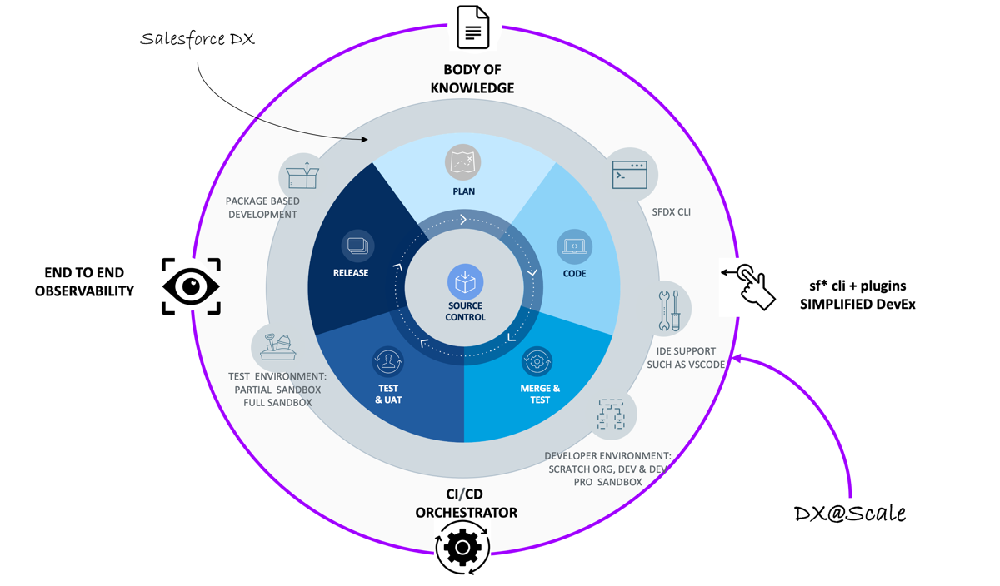

# DX@Scale

**DX@Scale** is a collection of practices, open-source tools, frameworks, and practitioners built on our experience in delivering large and complex Salesforce programs. Utilizing our **'curated'** practices, you can build a modular Salesforce Org that is reliable and easy to maintain.

## Why DX@Scale?

Salesforce has rightfully established not just a CRM platform, but as an Enterprise Platform (PaaS) that can be customized by **low/no/pro** coders for running various applications across the enterprise. Salesforce historically was a platform that was designed with '**clicks not code**' philosophy, however due to the scale of customization, criticality to the enterprise, and increase in number of applications, a new workflow based on modern development principles (command line interface, version control, modular development, temporary (ephemeral) development environments) was ushered through Salesforce DX in 2018.\
\
The introduction of Salesforce DX revolutionized the ways of working with Salesforce. Large and complex programs have often suffered from poor developer experience, unreliable deployments, and costly governance in the past due to lack of the right tooling/practices. DX@Scale was established to simplify the developer experience, achieve consistent and reliable deployment, and reduce the cost/overhead in Salesforce Programs.

DX@Scale extends the existing Salesforce DX ecosystem by providing:

1. Simplified Developer Experience
2. CI/CD Orchestration
3. End-to-End Observability&#x20;
4. Body of Knowledge for Modular Development

## Developer Experience with DX@Scale



An optimized Developer Experience is paramount for us while building DX@Scale. We are constantly focusing on improving our tools ensuring these practices are easy to adopt in your organization.

## When not to use DX@Scale?


DX@Scale is not fit for purpose for all use cases. Please proceed with caution when you are applying these tools/techniques and any of the underlying scenarios are met


1. You or your team is not convinced of the **benefits of modular development in Salesforce**
2. **Your release model is predicated on infrequent deployments with large batches**.  As we are unable to install all packages currently in a single transaction, the time to deploy in production will be extremely high.
3. **Your team is new to using version control and has no prior experience with ci/cd**
4. **You are only looking for devops tools, not an overall approach to modular development**
5. **No end-to-end ownership or visibility**, You or your team's responsibility ends with development, but some other team or personnel is responsible for deployment

