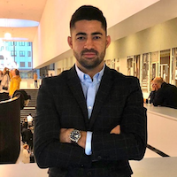

# Key Contributors

Lawrence is a systems architect and CTA and works for medium and large nonprofit organisations on technology and strategy. He's an advocate and believer in the power of the dxatscale products to help teams deliver better value through resilient DevOps processes

‌

.jpg>)

Genoud Magloire Douanla Djatio is a Senior Salesforce Developer at Astek Canada currently on a mandate at the National Bank of Canada, who builds robust and secure applications on the Salesforce platform. Genoud is passionate about DevOps practices on Salesforce platform and is behind the awesome profile functionality in sfpowerkit/sfpowerscripts

\
Jothy Sivanand - is Accenture Certified Senior Technology Architect and an inventor. He specializes in software architecture with a passion for automation and innovation. As a consultant, he had been advocating for DX@Scale, since October 2019 for large Salesforce implementation and transformations.

​

Ramesh is a Senior DevOps Engineer with good knowledge of key DevOps practices – Continuous Integration and Delivery, Strategy, Implementation, Security and Vulnerability Management (CDP) and Cloud concepts (AWS/Azure) - IaaS, PaaS, SaaS. He has been involved and part of DX@Scale journey since 2019 as an engineer, advocate, contributor, implementer, maintainer, trouble-shooter and successfully implemented CICD solutions for Salesforce on large/small scale projects.

.png>)

Hung set out the mission to tackle Salesforce DevOps practices head-on after he had been involved in delivering a large Salesforce transformation program and appalled at how far behind the DevOps capabilities were. Hung acts as an advisor to DX@Scale core team on tooling and practices.​

.png>)

Eric is a Salesforce Technical Architect who has been using sfpower\* tools across multiple programs. He contributes additions and fixes to documentation, as well provide feedback on the various commands.

Diefffrei is a salesforce architect at Expereo, He has been working on salesforce platform since 2007. and is entusiastic about DDD, TDD, writing clean code and DevOps including developer tooling that enables development teams to reach a higher level of productivity

.png>)

Kevin is a principal architect at FinancialForce where he focuses on product performance & scalability alongside developer tooling. He develops a set of open-source libraries and VSCode extensions for analysing Salesforce metadata and debug logs. Working for a large ISV has given him plenty of first hand experience of the difficulties of managing, analysing and refactoring metadata. He sees great value in the way DX@Scale is optimising the developer experience for everyone working on the platform.
