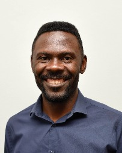

# Contributors

Lawrence is a systems architect and CTA and works for medium and large nonprofit organisations on technology and strategy. He's an advocate and believer in the power of the dxatscale products to help teams deliver better value through resilient DevOps processes

  
‌

Genoud Magloire Douanla Djatio is a Senior Salesforce Developer at Astek Canada currently on a mandate at the National Bank of Canada, who builds robust and secure applications on the Salesforce platform. Genoud is passionate about DevOps practices on Salesforce platform and is behind the awesome profile functionality in sfpowerkit/sfpowerscripts  

Hung set out the mission to tackle Salesforce DevOps practices head-on after he had been involved in delivering a large Salesforce transformation program and appalled at how far behind the DevOps capabilities were. Hung acts as an advisor to DX@Scale core team on tooling and practices.​

 

Eric is a Salesforce Technical Architect who has been using sfpower\* tools across multiple programs. He contributes additions and fixes to documentation, as well provide feedback on the various commands.

