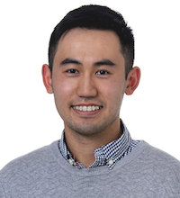
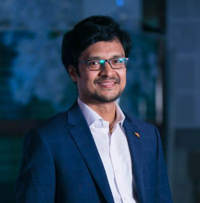

# Meet Our Team

Azlam has been always fascinated by how simple scripts could enhance the developer experience. From backgrounds in multiple technologies such as mobile games, mobile app development, web apps and backend, Azlam found his real calling, which is to create nifty tools that help one to push the boundaries of a platform. Ever since Azlam was tasked with solving Salesforce Development and Deployment experience, Azlam has been working with the broader Salesforce community and leading the vision of DX@Scale.

.jpg>)

Alan is a software engineer who builds automation and delivery tools for Salesforce. He has implemented effective CICD solutions on large-enterprise projects, and is a primary contributor to sfpowerscripts.

.jpg>)

Siv is Accenture Certified Senior Technology Architect and an inventor. He specializes in software architecture with a passion for automation and innovation. As a consultant, he had been advocating for DX@Scale, since October 2019 for large Salesforce implementation and transformations.

Vu is a Technology Architect with a broad range of experience across different technology platforms and software productivity tools. His recent areas of interest includes Salesforce DevOps, Cloud Native Architecture and General DevOps tooling, processes, and governance. He has been involved with DX@Scale since January 2020 as an implementation consultant, trainer, blog writer, and contributor and enjoys the endless potential to simplify and streamline Salesforce DevOps for the masses.

Caitlyn is a Software Engineer with a passion for all things IT, but particularly games. She has been involved with DX@Scale since April 2020 as an engineer, spokesperson, blog writer, trainer and troubleshooter. She loves working with DX@Scale and believes that anything which makes development and CICD simple is worth investing time and effort in.

Henry is a Software Engineer who enjoys finding gaps and inefficiencies in processes and building the optimal way of solving those problems. He has been a part of DX@Scale in engineering since March 2021. He is keen to work with the broader Salesforce community.

Ramesh is a Senior DevOps Engineer with good knowledge of key DevOps practices – Continuous Integration and Delivery, Strategy, Implementation, Security and Vulnerability Management (CDP) and Cloud concepts (AWS/Azure) - IaaS, PaaS, SaaS. He has been involved and part of DX@Scale journey since 2019 as an engineer, advocate, contributor, implementer, maintainer, trouble-shooter and successfully implemented CICD solutions for Salesforce on large/small scale projects.
