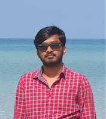
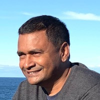
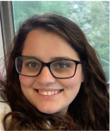

# Meet Our Team

Alan is a software engineer who builds automation and delivery tools for Salesforce. He has implemented effective CICD solutions on large-enterprise projects, and is a primary contributor to sfpowerscripts.  

Vu is a Tech Architect with a broad range of experience across different technology platforms and software productivity tools. His recent areas of interest includes Salesforce DevOps, Cloud Native Architecture and General DevOps tooling, processes, and governance.  He has been involved with DX@Scale since January 2020 as an implementation consultant, trainer, blog writer, and contributor and enjoys the endless potential to simplify and streamline Salesforce DevOps for the masses.

Caitlyn is a Software Engineer with a passion for all things IT, but particularly games. She has been involved with DX@Scale since April 2020 as an engineer, spokesperson, blog writer, trainer and troubleshooter. She loves working with DX@Scale and believes that anything which makes development and CICD simple is worth investing time and effort in. 

