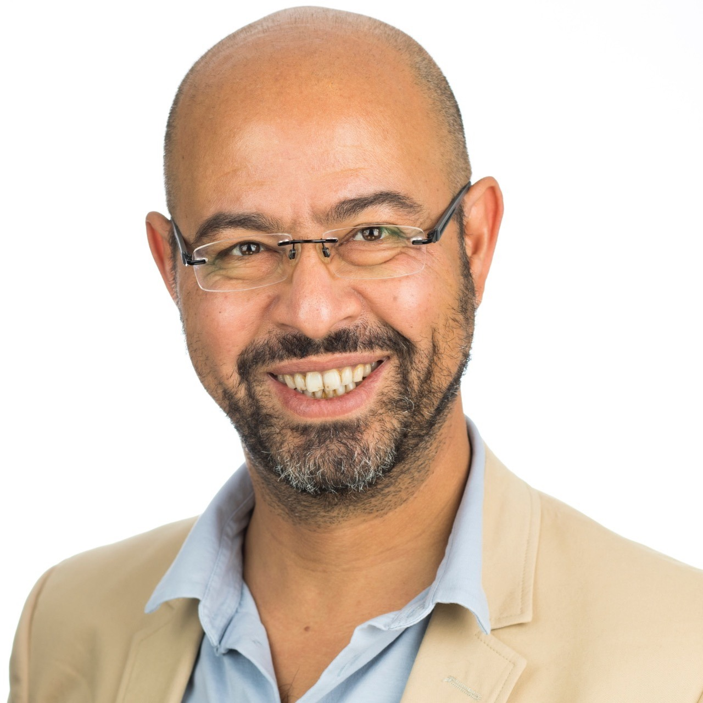

# Meet Our Team

Azlam has been always fascinated by how simple scripts could enhance the developer experience. From backgrounds in multiple technologies such as mobile games, mobile app development, web apps and backend, Azlam found his real calling, which is to create nifty tools that help one to push the boundaries of a platform. Ever since Azlam was tasked with solving Salesforce Development and Deployment experience, Azlam has been working with the broader Salesforce community and leading the vision of DX@Scale.

Ramzi is a Modular Salesforce Evangelist passionate about taming Salesforce complexity.  He strives to use Software Engineering principles and apply them to Salesforce & DevOps to improve the Developer Experience and reduce technical debt on Salesforce programs.

Vu is a Technology Architect with a broad range of experience across different technology platforms and software productivity tools. His recent areas of interest includes Salesforce DevOps, Cloud Native Architecture and General DevOps tooling, processes, and governance. He has been involved with DX@Scale since January 2020 as an implementation consultant, trainer, blog writer, and contributor and enjoys the endless potential to simplify and streamline Salesforce DevOps for the masses.

<figure><figcaption>
Zhebin Liu
</figcaption></figure>

Zhebin is a Salesforce developer with a passion for improving the developer experience. He joined [DX@scale](mailto:DX@scale) in April 2022 as a software developer, He is keen to build streamlined Salesforce development and deployment framework for everyone in this Salesforce eco-system

<figure><figcaption>
Ruslan Kurchenko
</figcaption></figure>

Ruslan is a Salesforce Technical Architect that always committed to continuous improvement, he consistently seeks opportunities to enhance engineers' performance and drive efficiency. He aims to create an unparalleled modular engineering experience for the Salesforce experts while advocating strongly for Continuous Delivery practices leveraging DX@Scale since 2022.

Diefffrei is a Salesforce Architect at Expereo, He has been working on Salesforce platform since 2007. and is enthusiastic about DDD, TDD, writing clean code and DevOps including developer tooling that enables development teams to reach a higher level of productivity
