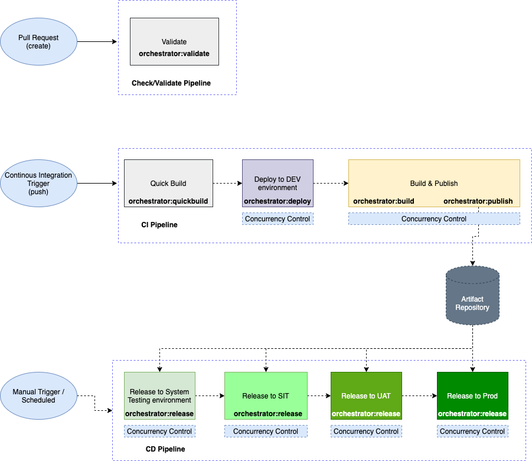

# A Typical  CI/CD Pipeline

 Let's look at a typical CI/CD pipeline for a package-based development in a program that has multiple environments. For brevity, validation before integration is not discussed

There are two key pipelines demonstrated in the above diagram

* **CI Pipeline**: A pipeline that gets triggered on every merge to the trunk. During this process, the following stages happen in sequence.

  * quickbuild a set of changed packages \(packages without validating for dependency or code coverage\).  The quickbuild outputs to the local artifact directory to be used by the deploy command. 
  * deploy to a Development Sandbox.  This process ensures the upgrade process of a package is accurate and you could also do a quick round of validation of your packages coming in from a scratch org.
  * Once deploy is successful, the pipeline proceeds to build the set of changed packages \(but this time with dependency validation and code coverage check\)
  * The pipeline could then publish these validated packages to an artifact repository for deployment into higher environments for further testing.

  Each of this stage could have a pre-approval step modelled.  

* **CD Pipeline**:  A Continuous Delivery Pipeline that gets triggered manually or automatically \(every day on a scheduled time interval\) deploying a set of the latest validated packages to a series of environment. The sequence of stages includes
  * Fetch the Artifacts from the artifact repository using the provided release definition
  * Deploy the set of packages say to System Testing environment
  * Upon successful testing, the same set of packages progress to the System Integration Test environment and so forth
  * If the packages are successful in all the testing, the packages are marked for promotion
  * The promoted packages are then deployed to production.

Take a note of each stage in the pipeline above and the key functionality required, such as build, deploy, fetch etc, this is typically done by inserting the equivalent sfdx commands into your CI/CD pipeline definition. As your number of packages grow, it not only is hard to maintain but is error prone. This is where [sfpowerscripts](https://sfpowerscripts.dxatscale.io/) [orchestrator](https://sfpowerscripts.dxatscale.io/faq/orchestrator) simplifies the pipeline to a one-time setup. All the stages are driven by sfdx-project.json, which ensures zero maintenance to the pipelines. Each stage of the above pipeline could be modelled by using equivalent sfpowerscripts orchestrator commands

