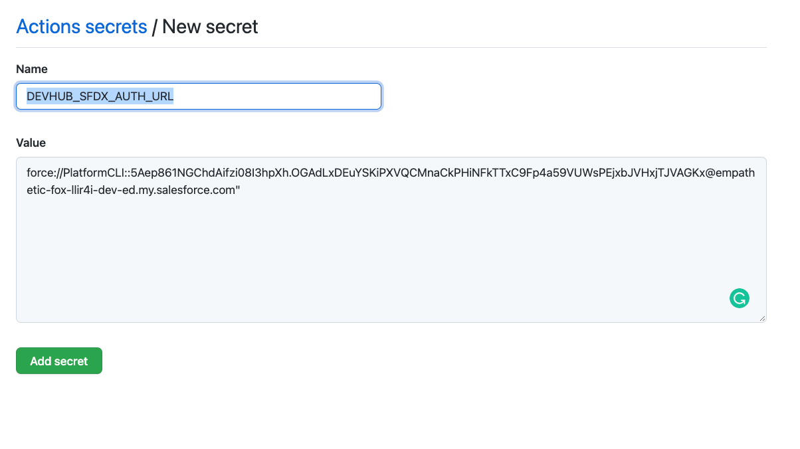

# Getting Started


## Clone Repo

Go to the repo: [https://github.com/dxatscale/dxatscale-template](https://github.com/dxatscale/dxatscale-template)

Click on **Use this template**


Enter in a **Repository name**, set your repo to **Private** and click **Create repository from template**


## Setup your Secrets

Before setting up your secrets you will need to create a [`sfdx authURL`](https://developer.salesforce.com/docs/atlas.en-us.sfdx_cli_reference.meta/sfdx_cli_reference/cli_reference_auth_sfdxurl.htm) to your devhub.

Once you have created your `authfile.json` go back to GitHub and create your secret:

1. On GitHub, navigate to the main page of the repository.
2. Under your repository name, click on the "Settings" tab.
3. In the left sidebar, click Secrets.
4. On the right bar, click on "New repository secret"


Under **Name** type in `DEVHUB_SFDX_AUTH_URL` and under **Value**, copy and paste the `sfdxAuthUrl` from `authfile.json`




Once you have done that repeat this step for all other orgs you have for your organisation such as SIT, QA, STAGING, PROD and so on. this is important when we go through the release stage of the pipelines. e.g. PROD\_SFDX_\__AUTH\_URL


## Pipeline Overview

Once you have set up all your Secret Variables make your way to **Actions** 


As you can see there are 8 pipelines, we will be going through each one in sequence as you would expect for a typical workflow.

All GitHub actions pipelines are located `YOUR_REPO/.github/workflows/`

### Environment Operations Pipelines

#### Replenish CI Pools - Auto Triggered \| `env-operations-prepare-ci-pool.yml`

This pipeline triggers on a daily schedule at midnight, and it will build a pool of prebuilt scratch orgs for your CI pipelines, which include managed packages as well as packages in your repository. 

Utilizing sfpowerscripts orchestrator command [prepare](https://sfpowerscripts.dxatscale.io/commands/prepare).

```text
sfdx sfpowerscripts:orchestrator:prepare --help
```

#### Replenish DEV Pools - Auto Triggered \| `env-operations-prepare-dev-pool.yml`

This pipeline triggers on a daily schedule at midnight, and it will build a pool of prebuilt scratch orgs for your developers to work on their own scratch org, which include managed packages as well as packages in your repository. 

Utilizing sfpowerscripts orchestrator command [prepare](https://sfpowerscripts.dxatscale.io/commands/prepare).


In order to fetch a scratch org to work on using the sfpowerscripts pool command [fetch](https://sfpowerscripts.dxatscale.io/commands/command-glossary#sfdx-sfpowerscripts-pool-fetch)

`sfdx sfpowerkit:pool:fetch --help`


```text
sfdx sfpowerscripts:orchestrator:prepare --help
```

#### Scratch Org Pool Cleaner - Auto Scheduled \| `env-operations-pool-cleaner.yml`

The pool cleaner pipelines trigger on a daily schedule at 11.00 pm; clean out unused scratch orgs from both CI and Dev Pools, allowing a fresh pool of prebuilt scratch orgs to be created for the following day.

Utilizing sfpowerscripts pool command [delete](https://sfpowerscripts.dxatscale.io/commands/command-glossary#sfdx-sfpowerscripts-pool-delete).

```text
sfdx sfpowerscripts:pool:delete --help
```

#### Scratch Org Recycler - User Triggered \| `env-operations-delete-scratchorg-pool.yml`

This pipeline is manually triggered by the user where you are wanting to delete a particular scratch org pool. A typical use case would be when a developer can't access the scratch org.

```text
sfdx sfpowerscripts:pool:org:delete --help
```

#### Publish Metrics for Scratch Org Pools \| `env-operations-publish-pool-metrics.yml`

This pipeline publishes metrics about the scratch orgs to a Monitoring tool every 30 minutes.

```text
sfdx sfpowerscripts:pool:metrics:publish --help
```

### Check/Validate Pipeline

#### PR Validation - Auto Triggered \| `validate.yml`

Pull request validation, as the name suggests. The validation pipeline will trigger in the main branch. helps you to validate a change made to your configuration or code. within this YAML file, we have three commands running:

Validating package changes using sfpowerscripts orchestrator command [validate](https://sfpowerscripts.dxatscale.io/commands/validate).

```text
sfdx sfpowerscripts:orchestrator:validate --help
```

Performing a static analysis of Apex classes using the sfpowerscripts analyze command pmd.

```text
sfdx sfpowerscripts:analyze:pmd --help
```

Validating metadata coverage for unlocked packages using sfpowerkit package command valid.

```text
sfdx sfpowerkit:package:valid --help
```

### Continuous Integration Pipeline

#### CI Pipeline - Auto Triggered \| `quickbuild-build-deploy.yml`

As developers work through their user stories and committing to their short-lived feature branches, they will be raising pull requests against the main branch; their feature branches will be reviewed and approved, triggering the CI Pipelines:

Within this stage, this YAML file the following sfpowerscripts orchestrator commands in sequence:

* The [quickbuild](https://sfpowerscripts.dxatscale.io/commands/build-and-quickbuild) command will be the packages without triggering dependency validation or code coverage checks.

```text
sfdx sfpowerscripts:orchestrator:quickbuild --help
```

* The deploy command removes the overhead of scripting individual package deployments. This will deploy the artifacts to Dev environment. however

### Continuous Delivery Pipeline

* CD Pipeline - User Triggered \| `release.yml`

