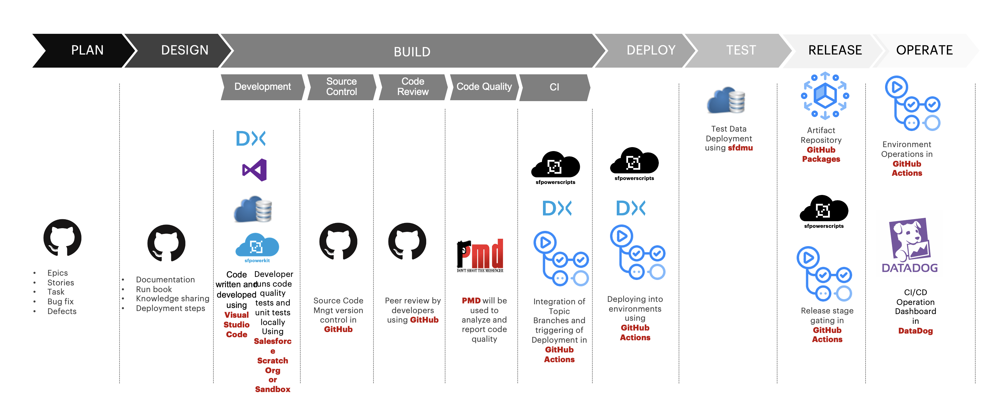

# Reference Implementation

A DX@Scale project can be implemented in any CI/CD platform.  There are certain prerequisites for an end-to-end implementation. Read more about it [here](https://sfpowerscripts.dxatscale.io/getting-started/prerequisites).

\*All the above logo depicted in the image above belong to their respective owners.

