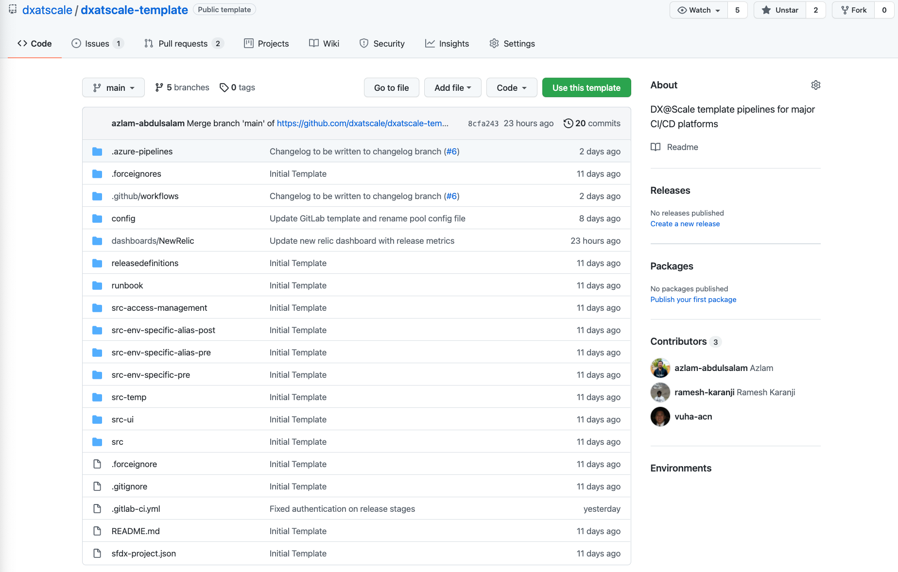
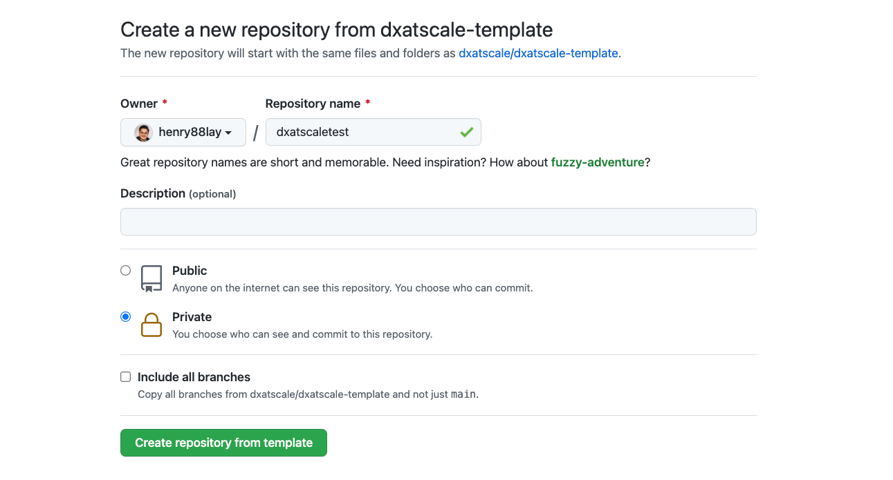
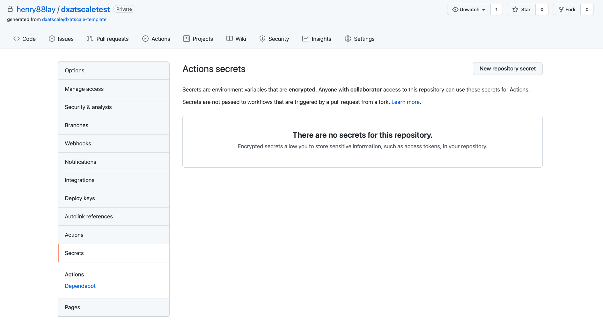
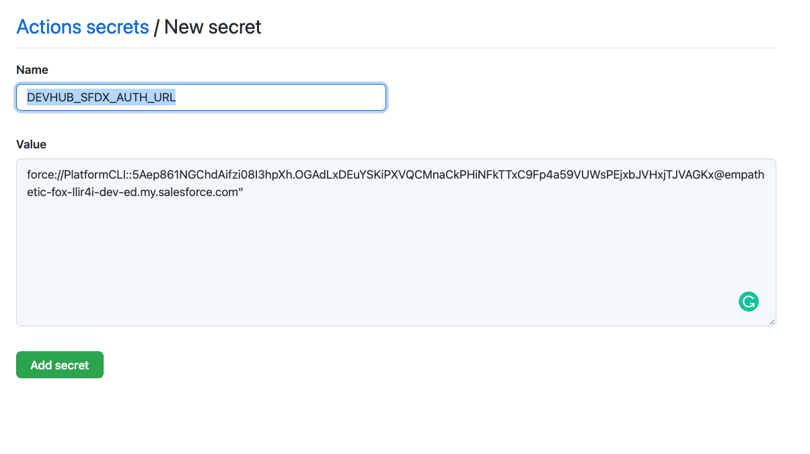
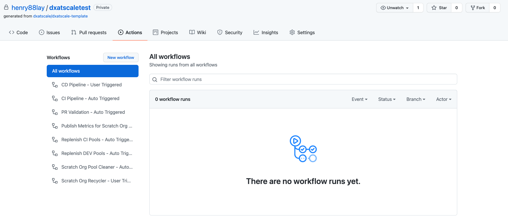

# Getting Started

The following getting started guide will enable you to configure and setup CI/CD using GitLab and DX@Scale for Salesforce.  Assuming you have reviewed and completed the prerequisite account setup and software tool installations, this guide will walk you through the initial setup process in Salesforce and GitLab using the [template](https://github.com/dxatscale/dxatscale-template) provided.  Along the way, additional general tips and best practices will be highlighted to help you understand the template provided and enable you to customize as needed.

As always, we welcome any feedback from the community to continuously improve this user guide. Please [contact us](https://docs.dxatscale.io/about-us/contact-us) for any questions or concerns.

## 1. Developer Workstation

In order to successfully troubleshoot and interact with GitHub and Salesforce using the CLI, the following commands should be executed on your computer to validate you have the tools configured correctly.  Depending on your operating system \(eg. **Mac OS, Windows, Linux**\), there may be some variation in the commands and outputs below on your terminal window.

###  Git

```bash
git version
> git version 2.32.0
```

### SFDX CLI

```bash
sfdx version
> sfdx-cli/7.110.0 darwin-x64 node-v16.6.0
```

### SFDX Plugins

```bash
sfdx plugins
> @dxatscale/sfpowerscripts 8.2.1
  sfdmu 4.4.5
  sfpowerkit 3.2.2
```

### Visual Studio Code

```bash
code --version
> 1.60.0
e7d7e9a9348e6a8cc8c03f877d39cb72e5dfb1ff
x64
```

### NPM

```bash
npm --version
> 7.19.1
```

## 2. Salesforce

To enable modular package development, there are a few configurations in Salesforce as a System Administrator that needs to be turned on to be able to create Scratch Orgs and Unlock Packages.

### A. Enable Dev Hub

[Enable Dev Hub](https://help.salesforce.com/s/articleView?id=sf.sfdx_setup_enable_devhub.htm&type=5) in your Salesforce org so you can create and manage scratch orgs and second-generation packages. Scratch orgs are disposable Salesforce orgs to support development and testing.

1. Navigate to the **Setup** menu
2. Go to **Development &gt; Dev Hub**
3. Toggle the button to on for **Enable Dev Hub**


### B. Enable Unlocked Packages and Second-Generation Managed Packages

[Unlocked packages](https://developer.salesforce.com/docs/atlas.en-us.sfdx_dev.meta/sfdx_dev/sfdx_dev_unlocked_pkg_intro.htm) help organize your existing metadata, package an app, extend an app that you’ve purchased from AppExchange, or package new metadata.

1. Navigate to the **Setup** menu
2. Go to **Development &gt; Dev Hub**
3. Toggle the button to on for **Enable Unlocked Packages and Second-Generation Managed Packages**


### C. Authenticate to DevHub via CLI

Authorize your production instance and/or Developer Edition Org using the [web login flow](https://developer.salesforce.com/docs/atlas.en-us.sfdx_cli_reference.meta/sfdx_cli_reference/cli_reference_auth_web.htm).  The example below uses "**DevHub**" as the alias for the instance where you will use to create Unlock Packages and manage Scratch Orgs.

```bash
sfdx auth:web:login -a DevHub -r https://login.salesforce.com
```

### D. Install sfpowerscripts Scratch Org Pooling Unlocked Package in DevHub

The [Scratch Org Pooling Unlocked Package](https://github.com/Accenture/sfpowerscripts/tree/develop/prerequisites/scratchorgpool) adds additional custom fields, validation rule, and workflow to the standard object "**ScratchOrgInfo**" in the the DevHub to enable associated scratch org pool commands to work for the pipeline.

```bash
sfdx force:package:install -p 04t1P000000gOqzQAE -u DevHub -r -a package -s AdminsOnly -w 30
```

### E. Install sfpowerscripts-artifact Unlocked Package in DevHub and Lower Existing Sandboxes

The [sfpowerscripts-artifact package](https://github.com/Accenture/sfpowerscripts/tree/develop/prerequisites/sfpowerscripts-artifact) is a lightweight unlocked package consisting of a custom setting **SfpowerscriptsArtifact2\_\_c** that is used to keep record of the artifacts that have been installed in the org. This enables package installation, using sfpowerscripts, to be skipped if the same artifact version already exists in the org.

```bash
sfdx force:package:install --package 04t1P000000ka9mQAA -u <OrgAlias> --securitytype=AdminsOnly --wait=120
```

### F. Authenticate to Lower Sandbox Environments via CLI

The template assumes you are following the environment strategy defined in our DX@Scale Guide.  The following sandboxes are recommended to be created and [authenticated](https://developer.salesforce.com/docs/atlas.en-us.sfdx_cli_reference.meta/sfdx_cli_reference/cli_reference_auth_web.htm) first prior to running the pipeline.  

* SHAREDDEV \(Shared Development\)
* ST \(System Test\)
* SIT \(System Integration Test\)
* UAT \(User Acceptance Test\)
* PROD \(Production\)


Assuming that Production is also your Dev Hub, we still recommend creating multiple CLI entries to segregate the connections.


Additional environments and customization can be made once you are familiar with the scripts.  



```bash
sfdx auth:web:login -a <orgAlias> -r https://test.salesforce.com
```



```
sfdx auth:web:login -a <orgAlias> -r https://login.salesforce.com
```



### G. Generate SFDX auth URL for Pipeline Authentication

In order for the GitHub pipeline to authenticate to the DevHub and other environments, [SFDX auth URL](https://developer.salesforce.com/docs/atlas.en-us.sfdx_cli_reference.meta/sfdx_cli_reference/cli_reference_auth_sfdxurl.htm) is the preferred method over [JWT Bearer Flow](https://developer.salesforce.com/docs/atlas.en-us.sfdx_dev.meta/sfdx_dev/sfdx_dev_auth_jwt_flow.htm).  For each environment, execute the following command on a previously authenticated environment and save the sfdxAuthUrl for use in future pipeline configuration steps.

```bash
sfdx force:org:display -u <orgAlias> --verbose --json > authFile.json
cat authFile.json
> {
  "status": 0,
  "result": {
    "id": "XXXXYYY",
    "accessToken": "00D8G0000009g7h!uhuRfGKbvPeubTZKztmFWgrykDuuVdxbffzjjVTqjMyRcV{wb+2JtxsevgKfGiGXRz02jY83uNBsD4CuWHwv.b21KZdFxbTi",
    "instanceUrl": "https://your.salesforce.com",
    "username": "vu.ha@accenture.com.dxatscale.shareddev",
    "clientId": "PlatformCLI",
    "connectedStatus": "Connected",
    "sfdxAuthUrl": "force://PlatformCLI::Cq$QLeQvDxpvUoNKgiDkoTqyVHdeoMupiZvkgHYcdVHsfMaDpqKJNbg#8ZtUpfBuIdVaUD0B21cFav5X2Pzv5X2@yoursalesforce.com",
    "alias": "SharedDev"
  }
}
```


Save only the following part of the **sfdxAuthUrl** for each environment  
  
`force://PlatformCLI::Cq$QLeQvDxpvUoNKgiDkoTqyVHdeoMupiZvkgHYcdVHsfMaDpqKJNbg#8ZtUpfBuIdVaUD0B21cFav5X2Pzv5X2@yoursalesforce.com`


## 3. GitHub

### A. Clone Repo

Go to the repo: [https://github.com/dxatscale/dxatscale-template](https://github.com/dxatscale/dxatscale-template)

Click on **Use this template**



Enter in a **Repository name**, set your repo to **Private** and click **Create repository from template**



### B. Setup your Secrets

Follow instructions in[ 2.F](getting-started.md#f-authenticate-to-lower-sandbox-environments-via-cli) to fetch all the authURL for each environment.

1. On GitHub, navigate to the main page of the repository.
2. Under your repository name, click on the "Settings" tab.
3. In the left sidebar, click Secrets.
4. On the right bar, click on "New repository secret"



Under **Name** type in `DEVHUB_SFDX_AUTH_URL` and under **Value**, copy and paste the `sfdxAuthUrl` from `authfile.json`




Once you have done that repeat this step for all other orgs you have for your organisation such as SIT, QA, STAGING, PROD and so on. this is important when we go through the release stage of the pipelines. e.g. PROD\_SFDX_\__AUTH\_URL


### C. Test your pipelines



It is recommended to test your pipelines by triggering the CI Pipeline - Auto triggered by triggering it manually. Monitor the pipeline till it produces a set of packages and publishes to GitHub Packages.  If this stage is successful, you can proceed to step 5

### D. Configure Scratch Org Pools

In your repo, there is a folder called config, in that folder, you can see there are two JSON files

* `project-ci-pool-def.json`
* `project-dev-pool-def.json`

As an overview Scratch Pools help development teams save the time taken to spin up scratch orgs allowing more time to be spent on development, installing all dependencies, and having it ready for development; in conjunction, we also use CI Pools.

To configure the time expiry and the number of orgs to be created and more, here are the file paths to the following scratch org definition YAML Files:

```text
YOUR_REPO/config/project-ci-pool-def.json
YOUR_REPO/config/project-dev-pool-def.json
```

Let's get started by looking at CI Pool Definition:

```javascript
{
  "$schema": "https://raw.githubusercontent.com/Accenture/sfpowerscripts/develop/packages/sfpowerscripts-cli/resources/schemas/pooldefinition.schema.json",
  "tag": "ci",
   "maxAllocation": 5,
   "expiry": 2,
   "batchSize": 5,
   "configFilePath": "config/project-scratch-def.json",
   "enableSourceTracking": false,
   "installAll": true,
    "fetchArtifacts": {
      "npm": {
        "scope": "MY_PROJECT_NAME",
        "npmtag": "main"
      }
    }
 
 }
```

Let's look at DEV Pool Definition now:

```javascript
{
    "$schema": "https://raw.githubusercontent.com/Accenture/sfpowerscripts/develop/packages/sfpowerscripts-cli/resources/schemas/pooldefinition.schema.json",
    "tag": "dev",
    "maxAllocation": 5,
    "expiry": 10,
    "batchSize": 5,
    "configFilePath": "config/project-scratch-def.json",
    "relaxAllIPRanges": true,
    "enableSourceTracking": true,
    "retryOnFailure": true,
    "succeedOnDeploymentErrors": true,
    "installAll": true,
    "fetchArtifacts": {
        "npm": {
          "scope": "MY_PROJECT_NAME",
          "npmtag": "main"
        }
      }
   
}
```


Update the "**scope**" value for "**npm**" from the default "**@org-name**" to your defined scope in the previous project variables section.  \(eg. **@dxatscale-poc**\)



To get an in-depth understanding of the options available to you for configuration refer to this link [here](https://sfpowerscripts.dxatscale.io/commands/prepare/scratch-org-pool-configuration).


### E. Scratch Org Definition File

The [project-scratch-def.json](https://developer.salesforce.com/docs/atlas.en-us.sfdx_dev.meta/sfdx_dev/sfdx_dev_scratch_orgs_def_file.htm) is a blueprint for a scratch org. It mimics the shape of an org that you use in the development life cycle, such as sandbox, packaging, or production.

Customize the provided scratch org definition file for your use case and save and commit the file to the repository.  If you want to use the file as is to test, **no action** is required.

```bash
{
    "orgName": "DX@Scale Demo Org",
    "edition": "Developer",
    "hasSampleData": false,
    "features": ["Communities", "Walkthroughs", "EnableSetPasswordInApi"],
    "settings": {
        "communitiesSettings": {
            "enableNetworksEnabled": true
        },
        "experienceBundleSettings": {
            "enableExperienceBundleMetadata": true
        },
        "lightningExperienceSettings": {
            "enableS1DesktopEnabled": true
        },
        "mobileSettings": {
            "enableS1EncryptedStoragePref2": false
        },
        "pathAssistantSettings": {
            "pathAssistantEnabled": true
        },
        "userEngagementSettings": {
            "enableOrchestrationInSandbox": true,
            "enableShowSalesforceUserAssist": false
        }
    }
}

```

### F. Project Configuration File

The [project configuration file](https://developer.salesforce.com/docs/atlas.en-us.sfdx_dev.meta/sfdx_dev/sfdx_dev_ws_config.htm) **sfdx-project.json** indicates that the directory is a Salesforce DX project. The configuration file contains project information and facilitates the authentication of scratch orgs and the creation of second-generation packages. It also tells the CLI where to put files when syncing between the project and scratch org.

The dxatscale-template [project configuration file](https://github.com/dxatscale/dxatscale-template/blob/main/sfdx-project.json) contains initial, pre-defined package directories based on our best practices for [repository structure](https://docs.dxatscale.io/scm/repository-structure) and modularization. 

| Package | Description |
| :--- | :--- |
| **src-env-specific-pre** | Installed first across all release environments. |
| **src-env-specific-alias-pre** | Installed after src-env-specific-pre and is only used when any environment specific metadata has to be aligned with each environments |
| **core** | A folder to house all the core model of your org which is shared with all other domains. |
| **src-ui** | This folder would include page layouts, FlexiPages and Lightning/Classic apps unless we are sure these will only reference the components of a single domain package and its dependencies. In general custom UI components such as LWC, Aura and VisualForce should be included in a relevant domain package. |
| **src-access-management** | This package is typically one of the packages that is deployed second to last in the deployment order and used to store profiles, permission sets, and permission set groups that are applied across the org. |
| **src-env-specific-alias-post** | Installed after src-env-specific-pre and is only used when any environment specific metadata has to be aligned with each environments |
| **src-temp** | This folder is marked as the default folder in sfdx-project.json. This is the landing folder for all metadata and this particular folder doesn't get deployed anywhere other than a developers scratch org. This place is utilized to decide where the new metadata should be placed into. |


Updates and additions to the project configuration file can be done gradually as you test your pipeline in GitLab.  **No changes** are needed to perform initial CI/CD tests across your environments as it will install the core package containing a AccountNumber field on the Account object as an example. 


### G. Release Definition File

Before triggering a release across environments for DX@Scale, a [release definition file](https://sfpowerscripts.dxatscale.io/commands/release) is required. A release is defined by a YAML file, where you can specify the artifacts to be installed in the org, in addition to other parameters. The release will then be orchestrated based on the configuration of the YAML definition file. 

The dxatscale-template [release-1.0.yml](https://github.com/dxatscale/dxatscale-template/blob/main/releasedefinitions/release-1.0.yml) file defines the initial core package artifact to be deployed across environments.  As you test out and add/modify existing packages, this file can be modified or a new release definition file can be created.   

```bash
release: "Release-1.0"
skipIfAlreadyInstalled: true
artifacts:
  #src-env-specific-alias-pre: main
  core: main
  #src-ui: main
  #src-access-management: main
  #src-env-specific-alias-post: main
changelog:
  workItemFilter: "issues/[0-9]+"
```


The release stage in the **.gitlab-ci.yml** file across the defined environments is where the release definition file is referenced.  As you create new releases, revisit these sections and update the file to the preferred release definition file to deploy.


### H. Change Log 

[Change Logs](https://sfpowerscripts.dxatscale.io/commands/release#changelog) are created to the **changelog** branch in the repository if the release is successful.  This is configured in the template using the `--generatechangelog` and `--branchname changelog` in the [orchestrator release](https://sfpowerscripts.dxatscale.io/commands/release) commands in sfpowerscripts.

**No changes** to this command is required unless you want to change the branch name to something different than **changelog**.

### I. Build Initial Package Artifacts

Prior to creating the scratch org pools, an initial version of artifacts should be created in the Package Registry by sfpowerscripts based on the project configuration file.  In the dxatscale-template, the initial **core package** will be generated once the pipeline is executed for the first time and the build stage is completed and has published to the Package Registry. 

1. Commit changes to trigger pipeline \(eg. Edit **AccountNumber\_\_c** field description\)
2. Navigate to **Package & Registries &gt; Package Registry**
3. Verify that the latest **core** artifact has been created and tagged with **main** label.

### J. Fetch Provisioned Developer Scratch Org from Pool

Once the **schedule-prepare-dev-pool** has completed successfully, a pool of active/unused developer scratch orgs tagged to the pool name **dev** will be available to be fetched and used to build new features.

```bash
sfdx sfpowerscripts:pool:fetch -a <SOAlias> -t dev -v <DevHub>
> ======== Scratch org details ========
KEY          VALUE
───────────  ────────────────────────────────────────────────────────────────────────────────────────────────────────────────────────────────────────────────────
Id           2SR4t00000001QeGAI
orgId        00D0i0000009VO4
loginURL     https://force-data-6074.cs98.my.salesforce.com/
username     test-uaojizr8cqxi@example.com
password     oy)Lnjphoq7tj
expiryDate   2021-09-11
sfdxAuthUrl  force://PlatformCLI::cUMRoQtoy)Lnjphoq7tj9PXadNVRdeTvCzyhp[FhUNsQsZDesdiVBHjZQjoCukBJUauxagGJgQUng6?gyYwkRmz@force-data-6074.cs98.my.salesforce.com/
status       Assigned
```

### K. Pull Requests and Merge to Main

1. Make changes
2. Commit
3. Raise a Merge Request
4. Confirm validation pipeline passes

### L. Add New Packages

1. Update project configuration files
2. Update **.gitlab-ci.yml** configuration file for the **analyze-pmd** and **validate-package jobs** for new packages
3. Save and validate

## Final words

Congratulations! you have gone through the Github Actions pipeline journey and made it to the end. 

I hope you have learned a great deal through this. as for where you go from here this is not the end but just the beginning:

Want to ask more about any of these practices, ask the team directly on Slack, Click the below link to get an invite.

And to discuss and contribute to our open-source projects [here](https://docs.dxatscale.io/about-us/contact-us#discussions)


