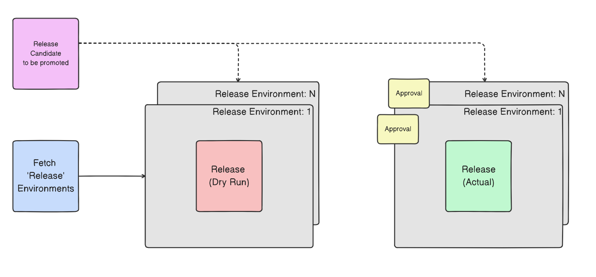

# Getting Started

The following getting started guide will enable you to configure and setup CI/CD using GitLab and DX@Scale for Salesforce.  Assuming you have reviewed and completed the prerequisite account setup and software tool installations, this guide will walk you through the initial setup process in Salesforce and GitLab using the [template](https://github.com/dxatscale/dxatscale-template) provided.  Along the way, additional general tips and best practices will be highlighted to help you understand the template provided and enable you to customize as needed.

As always, we welcome any feedback from the community to continuously improve this user guide. Please [contact us](https://docs.dxatscale.io/about-us/contact-us) for any questions or concerns.

## 1. Developer Workstation

In order to successfully troubleshoot and interact with GitLab and Salesforce using the CLI, the following commands should be executed on your computer to validate you have the tools configured correctly.  Depending on your operating system and shell system \(eg. **Mac OS, Windows, Linux**\), there may be some variation in the commands and outputs below on your terminal window.

###  Git

```bash
git version
> git version 2.32.0
```

### SFDX CLI

```bash
sfdx version
> sfdx-cli/7.110.0 darwin-x64 node-v16.6.0
```

### SFDX Plugins

```bash
sfdx plugins
> @dxatscale/sfpowerscripts 8.2.1
  sfdmu 4.4.5
  sfpowerkit 3.2.2
```

### Visual Studio Code

```bash
code --version
> 1.60.0
e7d7e9a9348e6a8cc8c03f877d39cb72e5dfb1ff
x64
```

### NPM

```bash
npm --version
> 7.19.1
```

## 2. Salesforce

To enable modular package development, there are a few configurations in Salesforce as a System Administrator that needs to be turned on to be able to create Scratch Orgs and Unlock Packages.

### A. Enable Dev Hub

[Enable Dev Hub](https://help.salesforce.com/s/articleView?id=sf.sfdx_setup_enable_devhub.htm&type=5) in your Salesforce org so you can create and manage scratch orgs and second-generation packages. Scratch orgs are disposable Salesforce orgs to support development and testing.

1. Navigate to the **Setup** menu
2. Go to **Development &gt; Dev Hub**
3. Toggle the button to on for **Enable Dev Hub**


### B. Enable Unlocked Packages and Second-Generation Managed Packages

[Unlocked packages](https://developer.salesforce.com/docs/atlas.en-us.sfdx_dev.meta/sfdx_dev/sfdx_dev_unlocked_pkg_intro.htm) help organize your existing metadata, package an app, extend an app that you’ve purchased from AppExchange, or package new metadata.

1. Navigate to the **Setup** menu
2. Go to **Development &gt; Dev Hub**
3. Toggle the button to on for **Enable Unlocked Packages and Second-Generation Managed Packages**


### C. Authenticate to DevHub via CLI

Authorize your production instance and/or Developer Edition Org using the [web login flow](https://developer.salesforce.com/docs/atlas.en-us.sfdx_cli_reference.meta/sfdx_cli_reference/cli_reference_auth_web.htm).  The example below uses "**DevHub**" as the alias for the instance where you will use to create Unlock Packages and manage Scratch Orgs.

```bash
sfdx auth:web:login -a DevHub -r https://login.salesforce.com
```

### D. Install sfpowerscripts Scratch Org Pooling Unlocked Package in DevHub

The [Scratch Org Pooling Unlocked Package](https://github.com/Accenture/sfpowerscripts/tree/develop/prerequisites/scratchorgpool) adds additional custom fields, validation rule, and workflow to the standard object "**ScratchOrgInfo**" in the the DevHub to enable associated scratch org pool commands to work for the pipeline.

```bash
sfdx force:package:install -p 04t1P000000gOqzQAE -u DevHub -r -a package -s AdminsOnly -w 30
```

### E. Install sfpowerscripts-artifact Unlocked Package in DevHub and Lower Existing Sandboxes

The [sfpowerscripts-artifact package](https://github.com/Accenture/sfpowerscripts/tree/develop/prerequisites/sfpowerscripts-artifact) is a lightweight unlocked package consisting of a custom setting **SfpowerscriptsArtifact2\_\_c** that is used to keep record of the artifacts that have been installed in the org. This enables package installation, using sfpowerscripts, to be skipped if the same artifact version already exists in the org.

```bash
sfdx force:package:install --package 04t1P000000ka9mQAA -u <OrgAlias> --securitytype=AdminsOnly --wait=120
```

### F. Authenticate to Lower Sandbox Environments via CLI

The template assumes you are following the environment strategy defined in our DX@Scale Guide.  The following sandboxes are recommended to be created and [authenticated](https://developer.salesforce.com/docs/atlas.en-us.sfdx_cli_reference.meta/sfdx_cli_reference/cli_reference_auth_web.htm) first prior to running the pipeline.  

* SHAREDDEV \(Shared Development\)
* ST \(System Test\)
* SIT \(System Integration Test\)
* UAT \(User Acceptance Test\)
* PROD \(Production\)


Assuming that Production is also your Dev Hub, we still recommend creating multiple CLI entries to segregate the connections.


Additional environments and customization can be made once you are familiar with the scripts.  



```bash
sfdx auth:web:login -a <orgAlias> -r https://test.salesforce.com
```



```
sfdx auth:web:login -a <orgAlias> -r https://login.salesforce.com
```



### G. Generate SFDX auth URL for Pipeline Authentication

In order for the GitLab pipeline to authenticate to the DevHub and other environments, [SFDX auth URL](https://developer.salesforce.com/docs/atlas.en-us.sfdx_cli_reference.meta/sfdx_cli_reference/cli_reference_auth_sfdxurl.htm) is the preferred method over [JWT Bearer Flow](https://developer.salesforce.com/docs/atlas.en-us.sfdx_dev.meta/sfdx_dev/sfdx_dev_auth_jwt_flow.htm).  For each environment, execute the following command on a previously authenticated environment and save the sfdxAuthUrl for use in future pipeline configuration steps.

```bash
sfdx force:org:display -u <orgAlias> --verbose --json > authFile.json
cat authFile.json
> {
  "status": 0,
  "result": {
    "id": "00D8G0000009g7hUXA",
    "accessToken": "00D8G0000009g7h!uhuRfGKbvPeubTZKztmFWgrykDuuVdxbffzjjVTqjMyRcV{wb+2JtxsevgKfGiGXRz02jY83uNBsD4CuWHwv.b21KZdFxbTi",
    "instanceUrl": "https://dxatscale--shareddev.my.salesforce.com",
    "username": "vu.ha@accenture.com.dxatscale.shareddev",
    "clientId": "PlatformCLI",
    "connectedStatus": "Connected",
    "sfdxAuthUrl": "force://PlatformCLI::Cq$QLeQvDxpvUoNKgiDkoTqyVHdeoMupiZvkgHYcdVHsfMaDpqKJNbg#8ZtUpfBuIdVaUD0B21cFav5X2Pzv5X2@dxatscale--shareddev.my.salesforce.com",
    "alias": "SharedDev"
  }
}
```


Save only the following part of the **sfdxAuthUrl** for each environment  
  
`force://PlatformCLI::Cq$QLeQvDxpvUoNKgiDkoTqyVHdeoMupiZvkgHYcdVHsfMaDpqKJNbg#8ZtUpfBuIdVaUD0B21cFav5X2Pzv5X2@dxatscale--shareddev.my.salesforce.com`


## 3. GitLab: Part I

The following steps will guide you through setting up the initial project, project access tokens, project variables and configuring your SSH keys.

### A. Configure SSH Keys in User Settings

[SSH keys](https://docs.gitlab.com/ee/ssh/index.html#gitlab-and-ssh-keys) allow you to establish a secure connection between your computer and GitLab. To stream line future git interactions with the repository in the GitLab, it recommended to add your SSH Key to the GitLab User Settings


To generate an SSH key pair, follow the [instructions](https://docs.gitlab.com/ee/ssh/#generate-an-ssh-key-pair) from the GitLab docs.


1. Navigate to **User Settings &gt; SSH Keys**
2. In the **Key** section, paste in the value of your public SSH key
3. **Title** will self-populate
4. Select a date value for **Expires at**
5. Click on the **Add key**


### B. Create New Project

Most work in GitLab is done in a [project](https://docs.gitlab.com/ee/user/project/working_with_projects.html). Files and code are saved in projects, and most features are in the scope of projects.

1. From the **GitLab Menu**, click on **Projects &gt; Create new project**
2. Select **Create blank project**
3. Enter **dxatscale-poc** for the **Project name**
4. Select your correct **Project URL**
5. Enter a **Project description \(optional\)** as needed
6. Leave **Visibility Level** to default **Private** with **README** to be initialized into the repository
7. Click on the **Create project** button


### C. Create Project Access Token

[Project access tokens](https://docs.gitlab.com/ee/user/project/settings/project_access_tokens.html) are similar to personal access tokens except they are attached to a project rather than a user. For the template, the Project Access Token is used to enable pushing git tags and change logs to the repository. 


Project Access Tokens are only supported on self-managed instances on Free tier and above and GitLab SaaS Premium and above.


1. From the **Project Menu**, click on **Settings &gt; Access Tokens**
2. Enter in **PROJECT\_ACCESS\_TOKEN** for the **Token name**
3. Set the **Expiration date** to a preferred date
4. Leave the default role to **Maintainer**
5. For the **Select scopes**, check the **api** option
6. Click on the **Create project access token** button
7. Save the **project access token value** to be used in subsequent steps in the project variable steps.


### D. Create Project Variables

[Project Variables](https://docs.gitlab.com/ee/ci/variables/) are a type of environment variable that will be used to control the behaviour of jobs and pipelines.  The template uses both variables and files in the CI/CD to setup the environment connections, NPM Registry Scope, Project Access Tokens, and optionally metrics dashboard connection details.

1. From the **Project Menu**, click on **Settings &gt; CI/CD**
2. Scroll down to **Variables** and click on the **Expand** button
3. Click on **Add variable**
4. Enter **PROJECT\_ACCESS\_TOKEN** for the **Key** field
5. Enter the key from previous steps in the **Value** field
6. In the **Flag** section, enable **Mask Variable** only and uncheck **Protect variable**
7. Leave **Environment Scope** to **All \(default\)**
8. Click on **Add variable** to save




Repeat the steps above and create the following variables below using the sfdxAuthUrl created earlier from the Salesforce CLI.

| Key | Value | Type |  Scope | Protect | Mask |
| :--- | :--- | :--- | :--- | :--- | :--- |
| DEVHUB\_ALIAS | devhub | Variable | All \(default\) | No | No |
| DEVHUB\_SFDX\_AUTH\_URL | &lt;sfdxAuthUrl&gt; | File | All \(default\) | No | Yes |
| NPM\_SCOPE | @dxatscale-poc | Variable | All \(default\) | No | No |
| PROD\_ALIAS | prod | Variable | All \(default\) | No | No |
| PROD\_SFDX\_AUTH\_URL | &lt;sfdxAuthUrl&gt; | File | All \(default\) | No | Yes |
| PROJECT\_ACCESS\_TOKEN | &lt;token&gt; | Variable | All \(default\) | No | Yes |
| SHAREDDEV\_ALIAS | shareddev | Variable | All \(default\) | No | No |
| SHAREDDEV\_SFDX\_AUTH\_URL | &lt;sfdxAuthUrl&gt; | File | All \(default\) | No | Yes |
| SIT\_ALIAS | sit | Variable | All \(default\) | No | No |
| SIT\_SFDX\_AUTH\_URL | &lt;sfdxAuthUrl&gt; | File | All \(default\) | No | Yes |
| ST\_ALIAS | st | Variable | All \(default\) | No | No |
| ST\_SFDX\_AUTH\_URL | &lt;sfdxAuthUrl&gt; | File | All \(default\) | No | Yes |
| UAT\_ALIAS | uat | Variable | All \(default\) | No | No |
| UAT\_SFDX\_AUTH\_URL | &lt;sfdxAuthUrl&gt; | File | All \(default\) | No | Yes |



The NPM\_SCOPE variable should start with the @ character.  Read more about npm scope [here](https://docs.npmjs.com/cli/v7/using-npm/scope).


## 4. Repository

### A. Clone Template Repository

The [dxatscale-template](https://github.com/dxatscale/dxatscale-template) repository contains the [.gitlab-ci.yml](https://docs.gitlab.com/ee/ci/yaml/gitlab_ci_yaml.html) configuration file for CI/CD jobs for DX@Scale.  It exists in the root of of the directory which is the default configuration for GitLab.  To start, clone the repository to your computer.  

```bash
git clone https://github.com/dxatscale/dxatscale-template.git
```


### B. Clone Project Repository

1. Navigate to **Repository &gt; Files**
2. Click on the **Clone** button to the right and copy the contents in **Clone with SSH** or **HTTPS**
3. Clone the repository to a folder on your computer

```bash
git clone git@gitlab.com:groupname/dxatscale-poc.git
```


### C. Copy Template Contents to Project Folder

There are a number of ways to copy the files over.  Some sample commands with the cp and rsync commands are provided below or alternatively, you can copy the files manually.


Ensure that you copy all hidden files/folders from the template **except** for the following folders **.git**, **.sfdx**, **.azure-pipelines**, **.github.**  These are specific to the template git repository and/or templates for other pipelines that DX@Scale supports. 

The root directory should contain a **.gitlab-ci.yml**, **.gitignore**, **.forceignores**, and **.forceignore**.  The original .git from your project repository should be there.


**Sample Commands**



```bash
cd dxatscale-template
cp -vR dxatscale-template dxatscale-poc
```



```
cd dxatscale-template
rsync -av dxatscale-template dxatscale-poc
```




### D. Commit Changes to Repository

Once the template files have been copied and verified, you can now stage, commit, and push your changes to the main branch.  This will baseline your code in the GitLab Project Remote Repository to get started.


Add [**\[skip ci\]**](https://docs.gitlab.com/ee/ci/yaml/#skip-pipeline) to the commit message to ensure the pipeline does not trigger for the initial commit. 


```bash
git add .
git commit -m "[skip ci] - Initial DX@Scale Template"
git push
```

### E. Validate in GitLab

Once the files have been committed, you can verify the files have been pushed the repository and the initial pipeline has skipped being triggered.

1. Navigate to **Repository &gt; Files**
2. Verify all the files are visible in the repository


1. Navigate to **CI/CD &gt; Pipelines**
2. Verify the pipeline has been skipped


## 5. GitLab: Part II

In this section, we will review and optionally customize the configuration files in the default template, setup schedule jobs for Scratch Org Pool Creation, and test the pipelines to deploy across your environments using the Package Registry.  

### A. Scratch Org Definition File

The [project-scratch-def.json](https://developer.salesforce.com/docs/atlas.en-us.sfdx_dev.meta/sfdx_dev/sfdx_dev_scratch_orgs_def_file.htm) is a blueprint for a scratch org. It mimics the shape of an org that you use in the development life cycle, such as sandbox, packaging, or production.

Customize the provided scratch org definition file for your use case and save and commit the file to repository.  If you want to use the file as is to test, **no action** is required.

```bash
{
    "orgName": "DX@Scale Demo Org",
    "edition": "Developer",
    "hasSampleData": false,
    "features": ["Communities", "Walkthroughs", "EnableSetPasswordInApi"],
    "settings": {
        "communitiesSettings": {
            "enableNetworksEnabled": true
        },
        "experienceBundleSettings": {
            "enableExperienceBundleMetadata": true
        },
        "lightningExperienceSettings": {
            "enableS1DesktopEnabled": true
        },
        "mobileSettings": {
            "enableS1EncryptedStoragePref2": false
        },
        "pathAssistantSettings": {
            "pathAssistantEnabled": true
        },
        "userEngagementSettings": {
            "enableOrchestrationInSandbox": true,
            "enableShowSalesforceUserAssist": false
        }
    }
}

```

### B. Scratch Org Pool Configuration Files

The [Scratch Org Pool configuration](https://sfpowerscripts.dxatscale.io/commands/prepare/scratch-org-pool-configuration) defines the pool of scratch orgs in sfpowerscripts.  The [JSON Schema definition file](https://raw.githubusercontent.com/Accenture/sfpowerscripts/develop/packages/sfpowerscripts-cli/resources/schemas/pooldefinition.schema.json) describes in detail which properties are accepted by the configuration file.  

Your Dev Hub org edition determines your scratch org [allocations](https://developer.salesforce.com/docs/atlas.en-us.sfdx_dev.meta/sfdx_dev/sfdx_dev_scratch_orgs_editions_and_allocations.htm). These allocations determine how many scratch orgs you can create daily, and how many can be active at a given point.

| Edition | Active Scratch Org Allocation | Daily Scratch Org Allocation |
| :--- | :--- | :--- |
| Developer Edition or Trial | 3 | 6 |
| Enterprise Edition | 40 | 80 |
| Unlimited Edition | 100 | 200 |
| Performance Edition | 100 | 200 |


Depending on your Dev Hub licensing, there are limits on the number of active and daily scratch orgs you can create daily.  sfpowerscripts will take this in account if you specify the **maxAllocation** property to a number more than you are allocated by Salesforce.


There are two configuration files defined in the template:

**Continuous Integration \(CI\) Pool** - [project-ci-pool-def.json](https://github.com/dxatscale/dxatscale-template/blob/main/config/project-ci-pool-def.json)

```bash
{
  "$schema": "https://raw.githubusercontent.com/Accenture/sfpowerscripts/develop/packages/sfpowerscripts-cli/resources/schemas/pooldefinition.schema.json",
  "tag": "ci",
   "maxAllocation": 5,
   "expiry": 2,
   "batchSize": 5,
   "configFilePath": "config/project-scratch-def.json",
   "enableSourceTracking": false,
   "installAll": true,
    "fetchArtifacts": {
      "npm": {
        "scope": "@dxatscale-poc",
        "npmtag": "main"
      }
    }
 
 }
```

**Developer Pool** - [project-dev-pool-def.json](https://github.com/dxatscale/dxatscale-template/blob/main/config/project-dev-pool-def.json)

```bash
{
    "$schema": "https://raw.githubusercontent.com/Accenture/sfpowerscripts/develop/packages/sfpowerscripts-cli/resources/schemas/pooldefinition.schema.json",
    "tag": "dev",
    "maxAllocation": 5,
    "expiry": 10,
    "batchSize": 5,
    "configFilePath": "config/project-scratch-def.json",
    "relaxAllIPRanges": true,
    "enableSourceTracking": true,
    "retryOnFailure": true,
    "succeedOnDeploymentErrors": true,
    "installAll": true,
    "fetchArtifacts": {
        "npm": {
          "scope": "@dxatscale-poc",
          "npmtag": "main"
        }
      }
   
}
```


Update the "**scope**" value for "**npm**" from the default "**@org-name**" to your defined scope in the previous project variables section.  \(eg. **@dxatscale-poc**\)


### C. Project Configuration File

The [project configuration file](https://developer.salesforce.com/docs/atlas.en-us.sfdx_dev.meta/sfdx_dev/sfdx_dev_ws_config.htm) **sfdx-project.json** indicates that the directory is a Salesforce DX project. The configuration file contains project information and facilitates the authentication of scratch orgs and the creation of second-generation packages. It also tells the CLI where to put files when syncing between the project and scratch org.

The dxatscale-template [project configuration file](https://github.com/dxatscale/dxatscale-template/blob/main/sfdx-project.json) contains initial, pre-defined package directories based on our best practices for [repository structure](https://docs.dxatscale.io/scm/repository-structure) and modularization. 

| Package | Description |
| :--- | :--- |
| **src-env-specific-pre** | Installed first across all release environments. |
| **src-env-specific-alias-pre** | Installed after src-env-specific-pre and is only used when any environment specific metadata has to be aligned with each environments |
| **core** | A folder to house all the core model of your org which is shared with all other domains. |
| **src-ui** | This folder would include page layouts, FlexiPages and Lightning/Classic apps unless we are sure these will only reference the components of a single domain package and its dependencies. In general custom UI components such as LWC, Aura and VisualForce should be included in a relevant domain package. |
| **src-access-management** | This package is typically one of the packages that is deployed second to last in the deployment order and used to store profiles, permission sets, and permission set groups that are applied across the org. |
| **src-env-specific-alias-post** | Installed after src-env-specific-pre and is only used when any environment specific metadata has to be aligned with each environments |
| **src-temp** | This folder is marked as the default folder in sfdx-project.json. This is the landing folder for all metadata and this particular folder doesn't get deployed anywhere other than a developers scratch org. This place is utilized to decide where the new metadata should be placed into. |


Updates and additions to the project configuration file can be done gradually as you test your pipeline in GitLab.  **No changes** are needed to perform initial CI/CD tests across your environments as it will install the core package containing a AccountNumber field on the Account object as an example. 


### D. Release Definition File

Before triggering a release across environments for DX@Scale, a [release definition file](https://sfpowerscripts.dxatscale.io/commands/release) is required. A release is defined by a YAML file, where you can specify the artifacts to be installed in the org, in addition to other parameters. The release will then be orchestrated based on the configuration of the YAML definition file. 

The dxatscale-template [release-1.0.yml](https://github.com/dxatscale/dxatscale-template/blob/main/releasedefinitions/release-1.0.yml) file defines the initial core package artifact to be deployed across environments.  As you test out and add/modify existing packages, this file can be modified or a new release definition file can be created.   

```bash
release: "Release-1.0"
skipIfAlreadyInstalled: true
artifacts:
  #src-env-specific-alias-pre: main
  core: main
  #src-ui: main
  #src-access-management: main
  #src-env-specific-alias-post: main
changelog:
  workItemFilter: "issues/[0-9]+"
```


The release stage in the **.gitlab-ci.yml** file across the defined environments is where the release definition file is referenced.  As you create new releases, revisit these sections and update the file to the preferred release definition file to deploy.


### E. Change Log 

[Change Logs](https://sfpowerscripts.dxatscale.io/commands/release#changelog) are created to the **changelog** branch in the repository if the release is successful.  This is configured in the template using the `--generatechangelog` and `--branchname changelog` in the [orchestrator release](https://sfpowerscripts.dxatscale.io/commands/release) commands in sfpowerscripts.

**No changes** to this command is required unless you want to change the branch name to something different than **changelog**.


### F. Build Initial Package Artifacts

Prior to creating the scratch org pools, an initial version of artifacts should be created in the Package Registry by sfpowerscripts based on the project configuration file.  In the dxatscale-template, the initial **core package** will be generated once the pipeline is executed for the first time and the build stage is completed and has published to the Package Registry. 

1. Commit changes to trigger pipeline

### G. Scheduled Jobs

[Pipeline schedules](https://docs.gitlab.com/ee/ci/pipelines/schedules.html#pipeline-schedules) are used to schedule pipelines at specific intervals. For the dxatscale-template, we leverage scheduled jobs in GitLab to prepare CI and developer scratch org pools, clean pools daily, publish scratch org and DevOps metrics to dashboards, and manually delete fetched developer scratch orgs.

1. Navigate to **CI/CD &gt; Schedules**
2. Click on **New schedule**
3. Enter **schedule-prepare-ci-pool** for **Description**
4. Click on **Custom** for **Interval Pattern** and enter value of **0 23 \* \* \***
5. Update **Cron Timezone** based on your region
6. Leave **Target Branch** to **main**
7. Add **TARGETTASKNAME** for the **Variable Key**.
8. Add **schedule-prepare-ci-pool** for the **Variable Value**
9. Keep **Activated** checked to **Active**
10. Click **Save pipeline schedule**


Repeat the steps above for all the scheduled jobs below. Interval Pattern should be scheduled during non-peak development windows for your development team to ensure limited disruption.  

| Description | Interval Pattern | Variable Key | Variable Value |
| :--- | :--- | :--- | :--- |
| **schedule-prepare-ci-pool** | 0 23 \* \* \* | TARGETTASKNAME | schedule-prepare-ci-pool |
| **schedule-prepare-dev-pool** | 0 22 \* \* \* | TARGETTASKNAME | schedule-prepare-dev-pool |
| **schedule-clean-pool** | 0 19 \* \* \* | TARGETTASKNAME | schedule-clean-pool |
| **schedule-report-so-pool** | 0 \* \* \* \* | TARGETTASKNAME | schedule-report-so-pool |


 **schedule-report-so-pool** is an optional job to configure if you intend to integrate to a Dashboard Platform such as New Relic and Data Dog.  If not, you can skip this configuration.



Once all schedule jobs have been configured, you can trigger the **schedule-prepare-ci-pool** and **schedule-prepare-dev-pool** jobs manually by clicking on the **play button** for each job.

The default tags for the pools are **ci** and **dev** and these can be referenced in future steps to retrieve developer sandboxes. 

### G. Fetch Provisioned Developer Scratch Org from Pool

Once the **schedule-prepare-dev-pool** has completed successfully, a pool of active/unused developer scratch orgs tagged to the pool name **dev** will be available to be fetched and used to build new features.

```bash
sfdx sfpowerscripts:pool:fetch -a <SOAlias> -t dev -v <DevHub>
> ======== Scratch org details ========
KEY          VALUE
───────────  ────────────────────────────────────────────────────────────────────────────────────────────────────────────────────────────────────────────────────
Id           2SR4t00000001QeGAI
orgId        00D0i0000009VO4
loginURL     https://force-data-6074.cs98.my.salesforce.com/
username     test-uaojizr8cqxi@example.com
password     oy)Lnjphoq7tj
expiryDate   2021-09-11
sfdxAuthUrl  force://PlatformCLI::cUMRoQtoy)Lnjphoq7tj9PXadNVRdeTvCzyhp[FhUNsQsZDesdiVBHjZQjoCukBJUauxagGJgQUng6?gyYwkRmz@force-data-6074.cs98.my.salesforce.com/
status       Assigned
```

### G. Manually Delete Fetched Scratch Org

1. Navigate to **CI/CD &gt; Pipelines**
2. Click on **Run Pipeline**
3. Enter in the username for the developer scratch org \(eg. **test-uaojizr8cqxi@example.com**\) for the value of **SCRATCH\_ORG\_USERNAME** variable key
4. Enter **manual-delete-fetched-so** value for the **TARGETTASKNAME** variable key
5. Click on **Run pipeline**


### H. Merge Requests and Merge to Main

1. Make changes
2. Commit
3. Raise a Merge Request
4. Confirm validation pipeline passes

### I. Add New Packages

1. Update project configuration files
2. Update .gitlab-ci.yml configuration file for the analyze-pmd and validate-package jobs for new packages
3. Save and validate

## Dashboard Integration

### A. New Relic Configurations

### B. Data Dog Configurations

Customize Packages for PMD and Package Validations

## Closing Thoughts

We hope you have successfully configured your pipelines in GitLab and on your way to modular packaging journey. 

