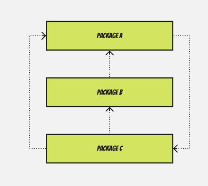
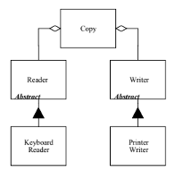

# Defining the boundaries of a package

For defining the boundaries of a package, we can adopt, but vary slightly, [OOD principles as defined by Bob Martin](http://butunclebob.com/ArticleS.UncleBob.PrinciplesOfOod) in a non-Salesforce environment. The core concepts are familiar to many that have developed in a non-Salesforce Object Oriented environment. These concepts transcend those environments and can be applied to Salesforce packaging as well; especially, with code. What follows are excerpts from Bob Martin (slightly modified). Please note, the document does not bring in all the information from the various reference. For more in-depth information, please see the link provided above.

The first three package principles are about package _**cohesion**_, they tell us what to put inside packages:

| **REP** | The Release Reuse Equivalency Principle | _The granule of **reuse** is the granule of **release**._      |
| ------- | --------------------------------------- | -------------------------------------------------------------- |
| **CCP** | The Common Closure Principle            | _Components that **change together** are packaged together._   |
| **CRP** | The Common Reuse Principle              | _Components that are **used together** are packaged together._ |

\
The last three principles are about the _**couplings**_ between packages and talk about metrics that evaluate the package structure of a system.\

| **ADP** | The Acyclic Dependencies Principle | _The dependency graph of packages must have no cycles._ |
| ------- | ---------------------------------- | ------------------------------------------------------- |
| **SDP** | The Stable Dependencies Principle  | _Depend in the direction of stability._                 |
| **SAP** | The Stable Abstractions Principle  | _Abstractness increases with stability. (Code-related)_ |

Principles in other discipline are just as applicable to Salesforce as they are to non-Salesforce Platform. The problem domain was well established before Salesforce, and we more recognize they apply now more than ever.

The Anatomy of a Package is important to understand; however, it is also important to apply principles to packages to obviate issues we would encounter later.

### Principles on Package Cohesion

#### The Release Reuse Equivalency Principle (REP)

> **The granule of reuse is the granule of release. Only components that are released through a tracking system can be effectively reused. This granule is the package **

Reusability is one of the most oft claimed goals of OOD. But what is reuse? &#x20;

Reuse can come in different flavours

* Textually inserting a bunch of code/components from one source to another
* Utilizing an existing module from someone else and bringing into the current source

The above examples of Reuse are of code/component copying; and it comes with a serious disadvantage, one must own the code/component that we copied. If the code/component doesn't work in the target environment, it must be changed. If there are bugs, it might be fixed. Fixes from the original author must be manually merged into the source.  Eventually the code/component copied diverges from the original that it can be hardly recognized. While code/component copying can make it easier to do some initial development; it does not help very much with the most expensive phase of the software lifecycle, _**maintenance**_.

REP states that the granule of reuse can be no smaller than the granule of release. Anything that we reuse must also be released. Packages are a candidate for a releasable entity. It might be possible to release and track classes or components, but there are so many components in a typical Salesforce org, that this would certainly overwhelm the release tracking system. We need some larger scale entity to act as the granule of release; and the package fits this need well.

#### The Common Closure Principle (CCP)

> **The components in a package are reused together. If you reuse one of the components in a package, you reuse them all.**

This principle helps us to decide which components should be placed into a package. It states that components \[1] that tend to be reused together belong in the same package. Components are seldom reused in isolation. Reusable classes/components collaborate with other classes/components that are part of the reusable abstraction. The **CRP** states that these classes/components belong together in the same package.

A simple example might be a trigger handler interface and its associated base classes. These classes are reused together because they are tightly coupled to each other. Thus, they ought to be in the same package.

#### The Common Reuse Principle (CRP)

> **The components in a package should be closed together against the same kind of changes. A change that affects a package affects all components in that package**

More important than reusability, is maintainability. When a change to components of an application is required, it would be beneficial if the changes were focused on a single package rather than across multiple packages. This ensures that a release for this change only contains the one package, other packages that don't depend upon the changed package do not need to be revalidated or re-released.

The **CCP** is an attempt to gather in one place all the components that are likely to change for the same reasons. For example, if two classes, are so tightly bound, either physically or conceptually, such that they always change together; then they belong in the same package. This minimizes the workload related to releasing, revalidating, and redistributing the software.

This principle is strongly associated with the _Open Closed Principle_ (**OCP**). For it is “_closure_” in the **OCP** sense of the word that this principle is dealing with. The **OCP** states that classes should be closed for modification but open for extension. 100% closure is not attainable. Closure must be strategic. Systems should be designed in such a way that they are closed to most likely kind of changes that we foresee.

**CCP** amplifies this by grouping together classes components cannot be closed against certain types of changes into the same packages. Thus, when a change in requirements comes along; that change has a good chance of being restricted to a minimal number of packages.

### Principles on Package Coupling

#### The Acyclic Dependencies Principle (ADP)

> **The dependency structure between packages must be a directed acyclic graph (DAG). That is there must be no cycles in the dependency structure**

Cyclical dependencies are not allowed in packages for a reason, it makes deploying packages impossible, imagine the following scenario where one has three packages A, B and C. These packages have the following dependency order, where B is dependent on A, C is dependent on B and A, and A itself which depends on Package C.

These packages are impossible to deploy on a new Org. One can't deploy Package A without deploying Package C and Package C itself can't be deployed without deploying Package A resulting in a standoff. Hence, cycles should be broken either by inverting the dependencies or by introducing a shared package which shares the common components for both Package A and Package C.

#### The Stable Dependencies Principle (SDP)

> **The dependencies between packages in a design should be in the direction of the stability of the packages. A package should only depend upon packages that are more stable that it is.**

Designs cannot be completely static. Some volatility is necessary if the design is to be maintained. We accomplish this by conforming to the _Common Closure Principle_ (**CCP**). By using this principle, we create packages that are sensitive to certain kinds of changes. These packages are designed to be volatile. We expect them to change.

Any package that we expect to be volatile should not be depended upon by a package that is difficult to change! Otherwise the volatile package will also be difficult to change.

By conforming to the **SDP**, we ensure that modules that are designed to be unstable (i.e. easy to change) are not depended upon by modules that are more stable (i.e. harder to change) than they are.

#### The Stable Abstractions Principle (SAP) \[Code-Related]

> **Packages that are maximally stable should be maximally abstract. Unstable packages should be concrete. The abstraction of a package should be in proportion to its stability.**

This principle sets up a relationship between stability and abstractness. It says that a stable package should also be abstract so that its stability does not prevent it from being extended. On the other hand, it says that an unstable package should be concrete since its instability allows the concrete code within it to be easily changed.

Consider the “_Copy_” program above. The “_Reader_” and “_Writer_” classes are abstract classes. They are highly stable since they depend upon nothing and are depended upon by “_Copy_” and all their derivatives. Yet, “_Reader_” and “_Writer_” can be extended, without modification, to deal with many kinds of I/O devices.

Thus, if a package is to be stable, it should also consist of abstract classes so that it can be extended. Stable packages that are extensible are flexible and do not constrain the design.

The **SAP** and the **SDP** combined amount to the Dependency Inversion technique for Packages. This is true because the **SDP** says that dependencies should run in the direction of stability, and the **SAP** says that stability implies abstraction. Thus, dependencies run in the direction of abstraction.

However, the **DIP** is a principle that deals with _classes_. And with classes there are no shades of grey. Either a class is abstract, or it is not. The combination of the **SDP** and **SAP** deal with packages and allow that a package can be partially abstract and partially stable.


The above article is a revised version of the original text contributed by [Bill Anderson](https://www.linkedin.com/in/bjanderson70/)


**\[**1] Code and Component represents elements in a Salesforce Org (i.e. Apex, Aura, LWC, etc.)

