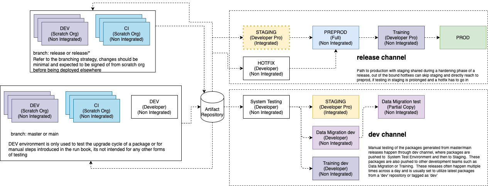

# Environment Strategy

One of the key tenants of DX@Scale is a simplified environment strategy that is based on these principles

* Any org should be able to be recreated using artifacts and associated run books \(if required\)
* Any development should be carried out in an individual scratch org provisioned just for the feature/task in hand
* There will be no long-lived continuous integration environments

  

The below table details each environment and the role of each environment in a typical DX@Scale project. Projects could have variation in the number of environments in the dev channel or release channel, such as multiple integrated environments, but the below environments are absolute essential.

| Environment | Type | License Type | Integrated | Role |
| :--- | :--- | :--- | :--- | :--- |
| DEV | Scratch Org | N/A | No | Development, any work item in a DX@Scale project will be developed in a scratch org. These scratch org's could be provisioned individually or fetched from a [pool](pooling-scratch-orgs.md).  Any bugfixes or hotfixes done against an existing release should be demonstrable in a scratch org.  This is intended to minimize pushing features as bugfixes to production using hotfix pathway. |
| CI | Scratch Org | N/A | No | Validate integration of a work item from a developer against main line using just in time CI Orgs. To speed up the process, the CI orgs could be pre-provisioned using pools. |
| DEV | Sandbox | Developer | No | This sandbox is used in a CI pipeline, where after merge, the created packages are deployed to this long lived sandbox for checking upgradeability. |
| System Testing | Sandbox | Developer | No | This environment is the first environment where all new packages will be tested. This environment will also have test data. |
| Staging | Sandbox | Developer Pro | Yes | Staging is the integrated environment where work items are tested against other connected environments. Test data will be deployed to this environment to make it meaningful. During the normal course of development, this environment mainly takes the role of SIT \(System Integration Testing\) environment.  As the development nears a release, or the release branch is cut, the environment is attached to the release feed and release packages are installed. The behaviour of the system changes to User Acceptance Testing. |
| Data Migration Dev\*\* | Sandbox | Developer | No | Environment utilized by the Data Migration developers in a large program to test their data migration scripts for mock deployments. Only packages that are successfully tested in System Testing Environment should be pushed into this environment.    |
| Data Migration Test\*\* | Sandbox | Partial Copy | No | Used by data migration teams to test the data migration scripts on a bigger data set. |
| Training Dev\*\* | Sandbox | Developer Pro | No | Environment utilized for developing training assets |
| Hotfix | Sandbox | Developer Pro | No | Environment utilized to test hotfix. This environment follows the artifacts deployed to production and not necessarily one in staging during release hardening phase  |
| PreProd | Sandbox | Full | No | Final staging environment before a release. This environment is deployed all the packages for the release and the data migration scripts are triggered \*\* to test the accuracy of scripts before deploying to production |
| Prod | Production |  |  |  |

\*\* Denotes optional environments, only utilized during a large transformation program where salesforce is to be introduced and  data has to be migrated from existing solutions

