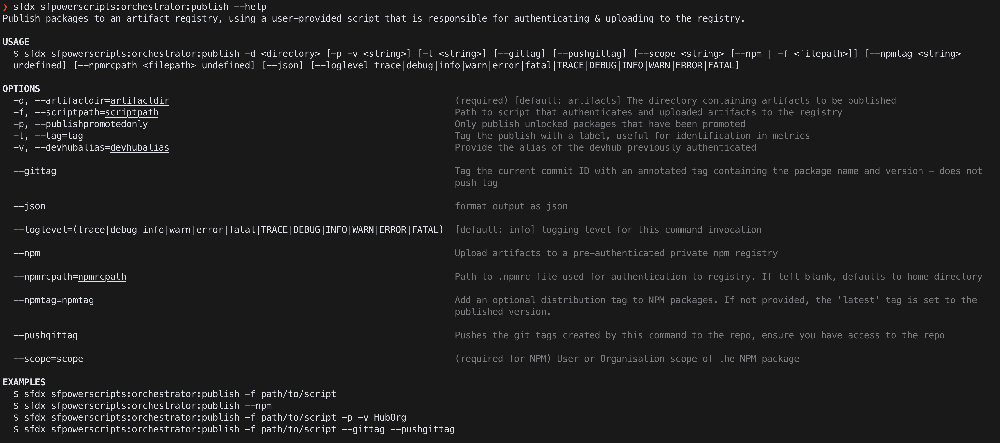
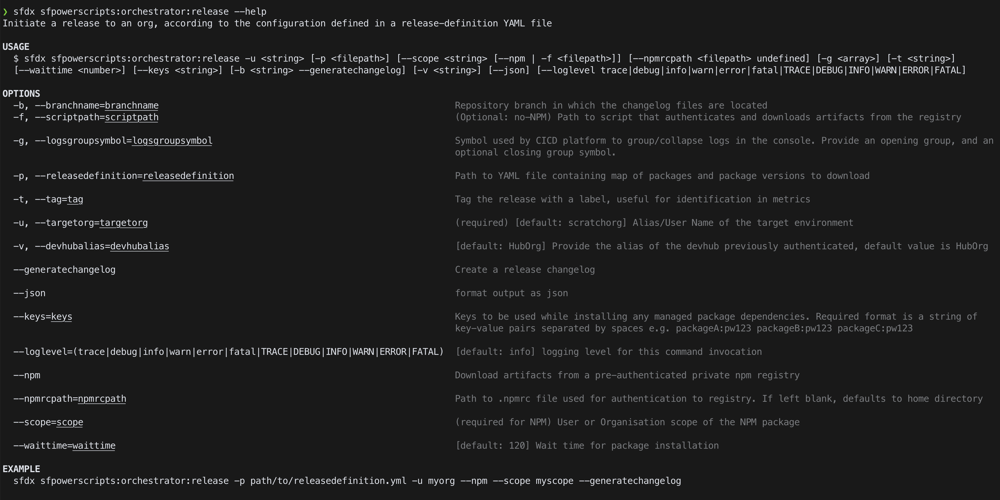

# Publish and Release your artifacts

### **Learning Objectives**

* What is an artifact?
* How to publish artifacts to an artifact registry?
* How artifacts are used by orchestrator?

**Time to complete:** 40 minutes

### Publish Command

The **Publish** command pushes artifacts created when you previously ran the **build** command, to an artifact registry primarily for further utilisation by a release pipeline. You must provide a shell script that handles the uploading of artifacts to a package registry of their choice. For this step, we will be going with GitHub Package Manager.

#### Options available for the publish command are here: 



You can also use the command below in the terminal to get more information

```text
sfdx sfpowerscripts:orchestrator:publish --help
```

#### Read more about the publish command and how it is being used in the [link](https://sfpowerscripts.dxatscale.io/commands/publish) 

**Artifacts**

Artifacts are a key concept in sfpowerscripts. Artifacts are traceable, versioned, immutable entities that get generated during the build or promote command. sfpowerscripts artifacts contain the source code of the package, metadata information, changelog and much more. Artifacts help sfpowerscripts to orchestrate deployment without being tied to the notion of branches.

#### Read more about artifacts and how it is being used in the [link](https://dxatscale.gitbook.io/sfpowerscripts/faq/artifacts) 

### Release Command

The **Release** command provides a simplified method of fetching artifacts from an artifact repository using the release definition file which contains the name of the artifacts that you want to download. fetching from the **NPM registry**, the command will handle everything else for you.

**Options available for the release command are here:**



You can also use the command below in the terminal to get more information

```text
sfdx sfpowerscripts:orchestrator:release --help
```

#### Read more about the release command and how it is being used in the [link](https://sfpowerscripts.dxatscale.io/commands/release) 

### Steps

#### Create a Personal Access token to publish packages to GitHub Package manager


* In the upper-right corner of any page, click your profile photo, then click **Settings**.


* In the left sidebar, click **Developer settings**.


* In the left sidebar, click **Personal access tokens**.


* Click **Generate new token**.


* Give your token a descriptive name.


* To give your token an expiration, select the **Expiration** drop-down menu, then click a default or use the calendar picker.


* Select the scopes, or permissions, you'd like to grant this token. To use your token to access repositories from the command line, select **repo**.


* Click **Generate token**.


Authenticate to GitHub package registry using the following command

```text
$ npm login --scope=@OWNER --registry=https://npm.pkg.github.com

> Username: USERNAME
> Password: TOKEN
> Email: PUBLIC-EMAIL-ADDRESS
```

#### Publish your packages to Github Package Registry

```text
sfdx sfpowerscripts:orchestrator:publish -d artifacts --npm --scope <your_github_org_name> --npmrcpath <path_to_your_npmrc> --gittag --pushgittag
```

_Notice how the packages are published into your dreamhouse repo._

#### Utilize Release command to orchestrate deployments at ease

Create a release definition file in the root of your repository. Information on creating release definition is available at this [link](https://dxatscale.gitbook.io/sfpowerscripts/commands/release)

Ensure all your external dependencies are marked in your release definition file

Create a new scratch org and run the release command

Ensure the sfpowerscripts prerequisite package is installed into your org

```text
sfdx sfpowerscripts:orchestrator:release -u <SO_ALIAS> -p .releaseDefinition.yml --npm --scope <GITHUB_ORG_NAME> --generatechangelog
```

**Delete** the artifacts directory in your folder

Notice how the release command install all the dependencies,  deploy all the packages directly and generate a changelog

### Recap 

This module helps you understand how sfpowerscripts can be utilized to orchestrate releases across multiple orgs


