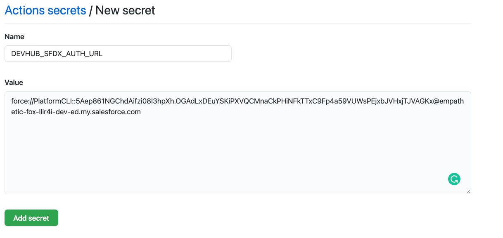

# Scratch Org Pooling Part 2

## **Learning Objectives**

* Why is scratch org pooling important in continuous integration? 
* What is the prepare command? 
* How do I use the prepare command? 

**Time to complete:** 30 minutes

### GitHub Actions

We will be using GitHub Actions paired with Yaml to create our CICD files. For more information on these, we recommend the following:

* [https://docs.github.com/en/actions/learn-github-actions](https://docs.github.com/en/actions/learn-github-actions) 
* [https://docs.github.com/en/actions/quickstart](https://docs.github.com/en/actions/quickstart)
* [https://docs.microsoft.com/en-us/azure/devops/pipelines/process/templates?view=azure-devops ](https://docs.microsoft.com/en-us/azure/devops/pipelines/yaml-schema?view=azure-devops&tabs=schema%2Cparameter-schema)

While this last article is related to Azure Pipelines, the concepts are relatively universal and can be applied to GitHub Actions.

## Steps

Good news! If you completed [Scratch Org Pooling Part 1](scratch-org-pooling.md) you have already completed the installation steps required. If you haven't, go back to this module and follow the instructions under the steps '**Install the prerequisite fields'**.

### Create a 'prepare' file

* Click on 'Actions' in your Dreamhouse-App repo


* Create a new workflow and name it 'prepare'
* Replace the contents of the file with the file below 

```text
# Unique name for this workflow
name: sfpowerscripts prepare

# Definition when the workflow should run
on:
    workflow_dispatch:
    schedule:
        - cron: '0 0 * * *'

# Jobs to be executed
jobs:
    prepare:
        runs-on: ubuntu-latest
        container: dxatscale/sfpowerscripts
        steps:
            # Checkout the code in the pull request
            - name: 'Checkout source code'
              uses: actions/checkout@v2
              with:
                  ref: master

            # Authenticate dev hub
            - name: 'Authenticate Dev Hub'
              run: |
                echo "${{ secrets.DEVHUB_SFDX_AUTH_URL }}" > ./authfile
                sfdx auth:sfdxurl:store -f authfile -a devhub

            # Prepare a pool of scratch orgs
            - name: 'Prepare a pool of scratch orgs'
              run: 'sfdx sfpowerscripts:orchestrator:prepare -f config/poolconfig.json -v devhub'

```

What is this file doing? Let's have a look.

**First**, it's given the name 'sfpowerscripts prepare'

**Secondly**, it's given a time schedule on which to run. This schedule is set to run every day at midnight.

**Thirdly** it is given a list of steps to execute in a specific order. These steps are:

1. Check out the source code of your project, on branch 'master'. If you would prefer a different branch checked out, supply this branch in the 'ref' section
2. Authenticate the DevHub using sfdx authURL, [more information on sfdx authURL](https://developer.salesforce.com/docs/atlas.en-us.sfdx_cli_reference.meta/sfdx_cli_reference/cli_reference_auth_sfdxurl.htm)
3. Execute the 'prepare' command 

### Edit your "poolconfig.json" file in the config folder

Copy and paste the code on your poolconfig.json

```javascript
{
    "$schema": "https://raw.githubusercontent.com/Accenture/sfpowerscripts/develop/packages/sfpowerscripts-cli/resources/schemas/pooldefinition.schema.json",
    "tag": "preparepool",
    "maxAllocation": 3,
    "expiry": 2,
    "batchSize": 3,
    "configFilePath": "config/project-scratch-def.json",
    "enableSourceTracking": false,
    "installAll": true
}
```

After you have created and added the snippet commit the changes into your repo.

### Add GitHub Secrets

Notice in the code above, there are 'secrets' in the authentication task. Secrets are GitHub Action's way of hiding variables within your code, in this case your yaml file. More information on secrets can be found here: [https://docs.github.com/en/actions/reference/encrypted-secrets\#:~:text=The%20secrets%20that%20you%20create,use%20them%20in%20a%20workflow.](https://docs.github.com/en/actions/reference/encrypted-secrets#:~:text=The%20secrets%20that%20you%20create,use%20them%20in%20a%20workflow.)

Let's set up the secrets we need.


It is recommended to set up a new trailhead playground with DevHub and Unlocked packages enabled for the Orchestrator modules.


**First**, if you haven't previously, you will need to set up an _sfdx authurl_. We will not explicitly cover this subject, as the instructions are located here: [https://developer.salesforce.com/docs/atlas.en-us.sfdx\_cli\_reference.meta/sfdx\_cli\_reference/cli\_reference\_auth\_sfdxurl.htm](https://developer.salesforce.com/docs/atlas.en-us.sfdx_cli_reference.meta/sfdx_cli_reference/cli_reference_auth_sfdxurl.htm) 

* Go to your GitHub repository and select 'Settings' 


* Now select 'Secrets' 


* Now open the '**authFile.json**' file you created when setting up the _sfdx authURL_ and add the **sfdxAuthUrl** contents of the file as a 'secret' value with the name **DEVHUB\_SERVER\_KEY** 



Select 'New repository secret' 

### Run your workflow

* Go back to actions and select the workflow 


* Run the workflow by selecting 'run workflow' 


* Select the job to watch it running through the tasks and create the scratch orgs required

## Recap

Congratulations! You have just created a scratch org pool specifically for use in your CICD workflow! You have also learned about GitHub actions and are on your way to being a CI/CD Master.

