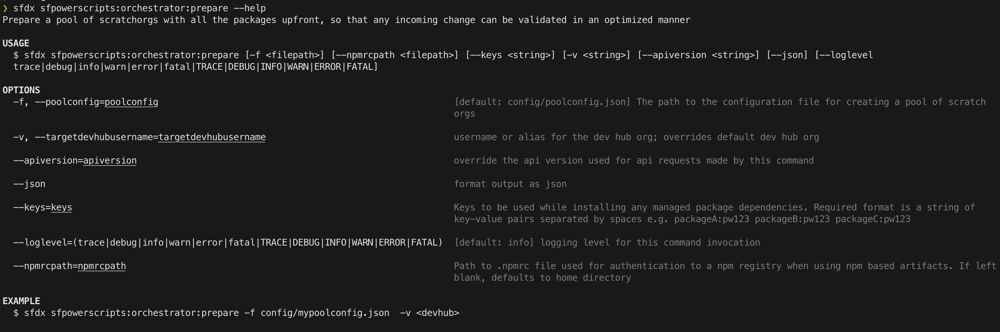

# Scratch Org Pooling Part 1

### Learning Objectives

* What is a scratch org pool? 
* What are the benefits of using a scratch org pool? 
* What are the different types of scratch org pools?
* How do I set up a scratch org pool? 
* What is the prepare command? 
* How do I use the prepare command? 

**Time to Complete:** 90 Minutes

### What is a Scratch Org Pool? 

We discussed what scratch orgs are in an [earlier](4.-scratch-org-introduction.md) section. While scratch orgs are a great way of developing on the Salesforce platform, the time it takes to spin up an org and install all the dependencies grows with each iteration of development. What DX@Scale has done is taken the scratch org capability and extended it to create a "pool" of scratch orgs available for development or for use as 'Just in time' Continuous Integration environments used for validating changes in your org. 

### Types of Scratch Org Pools

DX@Scale offers two types of scratch org pools 

1. A pool that can be used by developers to work on features. These scratch org pools will typically have a longer duration.
2. A pool that is used in your validation stage during the Continuous Integration pipeline

We will be discussing type 1 in this module and will do a "part 2" in the next module. 

## Prepare Command

The prepare command, which is a part of the orchestrator functionality of sfpowerscripts was introduced in 2020 and provides scratch org pooling, specifically tailored for use in your CICD platform.

Prepare command helps you to build a pool of prebuilt scratch orgs which include managed packages as well as packages in your repository. This process allows you to considerably cut downtime in re-creating a scratch org during the validation process when a scratch org is used as a Just-in-time CI environment.

#### Options available for the prepare command are here: 



You can also use the command below in the terminal to get more information

```text
  sfdx sfpowerscripts:orchestrator:prepare -f config/mypoolconfig.json  -v <devhub>
```

### **Steps**

#### **Install the prerequisite fields** 

In order for scratch org pooling to work, you will need to install the **sfpower-scratchorg-pool** unlocked package into your DevHub

* Log into your DevHub 
* Navigate to [https://login.salesforce.com/packaging/installPackage.apexp?p0=04t1P000000gOqzQAE](https://login.salesforce.com/packaging/installPackage.apexp?p0=04t1P000000gOqzQAE)
* Select 'Install for Admin Only' 

#### Build a Pool Configuration

A pool configuration defines the 'shape' of your scratch org pool. This includes how it is identified, the size and when the pool expires. 

You can find all the **configuration fields** that can be specified when defining your pool [here](https://sfpowerscripts.dxatscale.io/commands/prepare/scratch-org-pool-configuration).

### Sample configuration files

```text
{
    "tag": "examplepool",
    "maxAllocation": 20,
    "expiry": 10,
    "batchSize": 10,
    "configFilePath": "config/project-scratch-def.json",
    "relaxAllIPRanges": true,
    "installAll": true,
    "enableSourceTracking": true,
    "retryOnFailure": true,
    "succeedOnDeploymentErrors": true
}
```


**For this module, all IP ranges relaxed, as in the example schema above**


* Create a **poolconfig.json** file in your repo with a file path of **config/poolconfig.json**
* Add the above example schema 
* Update the "max\_allocation" tag to 2 
* Make sure the config file path is pointing to your correct project-scratch-def.json location 
* Commit the file to your repo 

#### Create your pool

With all the pre-work we have done, the command to create the pool is deceptively simple 

```text
sfdx sfpowerscripts:orchestrator:prepare -f config/poolconfig.json -v Devhub
```

#### Fetch a scratch org

Now try to use your scratch org pool by fetching it using this command 

```text
sfdx sfpowerscripts:pool:fetch --tag examplepool -v Devhub -a Alias
```

The username and password will be outputted from this command which you can use to log in at [https://test.salesforce.com](https://test.salesforce.com/) 

#### Delete the pool 

We don't need the pool for the next modules, so let's clear up your scratch org space using the delete command. 

```text
sfdx sfpowerscripts:pool:delete --tag examplepool -v Devhub
```

### Recap

Well done. Scratch org pooling is a big topic to complete. You should now know what a pool is, why you would use one and how to set one up. 

Keep your scratch org pool schema in your repo, we will use it later. 

