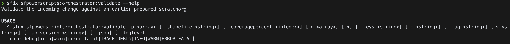

# Validating your changes

### **Learning Objectives**

* How DX@Scale has combined SFDX and Continuous Integration 
* How to validate changes using the 'validate' command 

**Time to complete:** 20 minutes

### Validate Command

**Validate** command helps you to validate a change made to your configuration/code. This command is triggered as part of your pull request process, to ensure the correctness of configuration/code, before being merged into your **main** branch. validate simplifies setting up and speeding up the process by using a scratch org prepared earlier using the [prepare ](scratch-org-pooling-part-2-prepare.md)command.

**validate** command runs the following checks

* Checks accuracy of metadata by deploying the metadata to a Just-in-time CI org
* Triggers Apex Tests
* Validate Apex Test coverage of each package

Options available for the validate command are here: 



You can also use the command below in the terminal to get more information

```text
sfdx sfpowerscripts:orchestrator:validate --help
```

### Steps 

**Create a 'validate' file**

* Click on 'Actions' in your Dreamhouse-App repo


* Create a new workflow and name it 'validate'
* Replace the contents of the file with the file below 

```text
name: 'PR Validation - Auto Triggered'

on:
  pull_request:
    types: [opened, synchronize, reopened]
    branches:
      - main
      - release/**

# Jobs to be executed
jobs:
  validate:
    name: 'Validate Changed Packages'
    runs-on: ubuntu-latest
    container: dxatscale/sfpowerscripts

    steps:
      - uses: actions/checkout@v2
        with:
          fetch-depth: 0

      - run: |
          echo 'y' | sfdx plugins:install @dxatscale/sfpowerscripts
      - name: 'Authenticate Dev Hub'
        run: |
          echo "${{ secrets.DEVHUB_SFDX_AUTH_URL }}" > ./authfile
          sfdx auth:sfdxurl:store -f authfile -a devhub
          
      # Validate source and trigger test
      - name: 'Push source to scratch org'
        run: 'sfdx sfpowerscripts:orchestrator:validate -p ci -v devhub -x'

```

What is this file doing? Let's have a look.

**First**, it's given the name 'PR Validation - Auto Triggered'

**Secondly**, It's given conditions to when to run, so when a pull request event occurs and within two branches main and release/\*\*

**Thirdly** it is given a list of steps to execute in a specific order. These steps are:

1. Check out the source code of your project, on branch 'master'. If you would prefer a different branch checked out, supply this branch in the 'ref' section
2. Authenticate the DevHub using sfdx authURL, [more information on sfdx authURL](https://developer.salesforce.com/docs/atlas.en-us.sfdx_cli_reference.meta/sfdx_cli_reference/cli_reference_auth_sfdxurl.htm)
3. Execute the 'validate' command 

_\(Hint: Make sure you align the validate command with the prepare command from the previous module\)_

* Run your new workflow 

### Recap

This is a short module, as it reuses the concepts learned in prepare. Well done, you now know how to simply validate your changes. You can now see how you can have this set up to be triggered on every pull request to your main or develop branches. 


