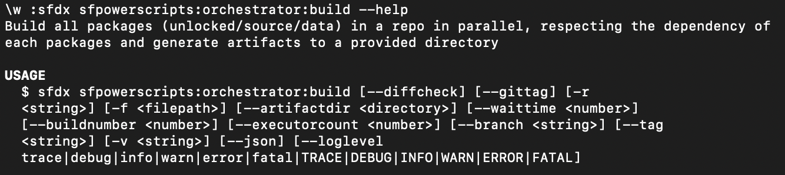

# New Relic

## Account Setup

1.  Create a [new account](https://newrelic.com/signup) on New Relic and verify your email.\

    <figure><figcaption>
New Relic: Account Creation
</figcaption></figure>

    \

    <figure><figcaption>
New Relic Home Page 
</figcaption></figure>
2.  Click on your **Profile** and navigate to "**API keys**".\

    <figure><figcaption>
API Keys
</figcaption></figure>
3.  Click on "**Create a key**"\

    <figure><figcaption>
Create a key
</figcaption></figure>
4.  Select "**Ingest - Licence**" for the **Key Type** and enter in details for the "**Name**" and "**Notes**"\

    <figure><figcaption>
Ingest - License - Key Creation
</figcaption></figure>
5.  Confirm Licence has been created\

    <figure><figcaption>
Licence Created
</figcaption></figure>
6.  Copy the **key** from the new "**Ingest - Licence"** and create a variable in your pipeline labeled "`SFPOWERSCRIPTS_NEWRELIC_API_KEY`" and assign the value of the key.  Ensure to mask this value.\

    <figure><figcaption>
Sample GitLab Variable for New Relic API Key
</figcaption></figure>
7.  Add another additional variable named "SFPOWERSCRIPTS\_NEWRELIC" and set the value to "**true**". \

    <figure><figcaption>
<strong>SFPOWERSCRIPTS_NEWRELIC Variable</strong>
</figcaption></figure>
8.  Retrieve your "**Account ID**" under **Profile > Administration > Access Management > Accounts**\
    ****

    <figure><figcaption></figcaption></figure>
9.  Update the `cicd-dashboard.json` file in `dashboards/NewRelic` folder with the value of the "**Account id**" for all instances of `<your-account-id>`in the file.  Ensure to include the quotation marks for the "Account id". (eg. "1234567")\

    <figure><figcaption></figcaption></figure>
10. Trigger the scheduled job for "**schedule-report-so-pool**" job and confirm success.


Avoid checking in the updated **"Account id"** file directly in your repository if you want to keep this as a secret.  This is only needed to import into the Dashboard in the next section.


## Dashboard View

1.  Navigate to the Dashboard and click on "**Import Dashboard**".\

    <figure><figcaption>
Import Dashboard
</figcaption></figure>
2.  Copy and paste the edited contents of the "`cicd-dashboard.json"` file in the previous section with the updated "Account id".\

    <figure><figcaption>
JSON Import Dashboard
</figcaption></figure>
3. Click on "**Import dashboard**"
4.  Confirm the "**Salesforce CI/CD Dashboard**" is created.\

    <figure><figcaption></figcaption></figure>
5.  Click to view details for the "**Salesforce CI/CD Dashboard**"\
    \

    <figure><figcaption></figcaption></figure>


Metrics are meant to be reviewed and monitored to ensure the success of your CI/CD setup.  Ensure that the team is reviewing the dashboard frequently and identify issues across Scratch Org Creations, Deployments,

