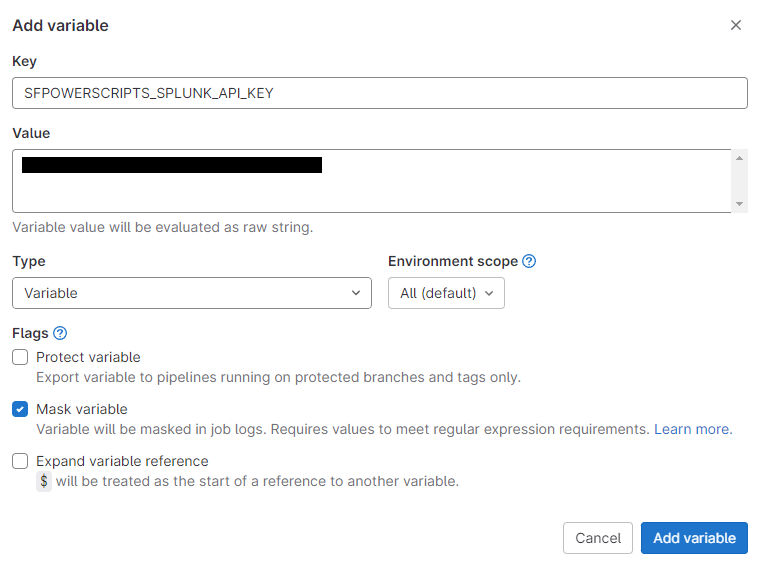
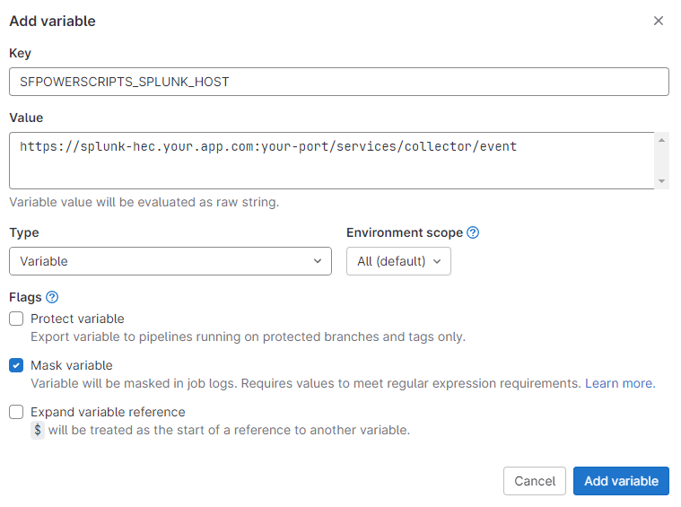
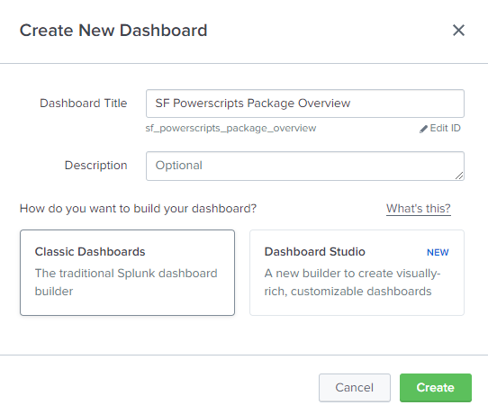
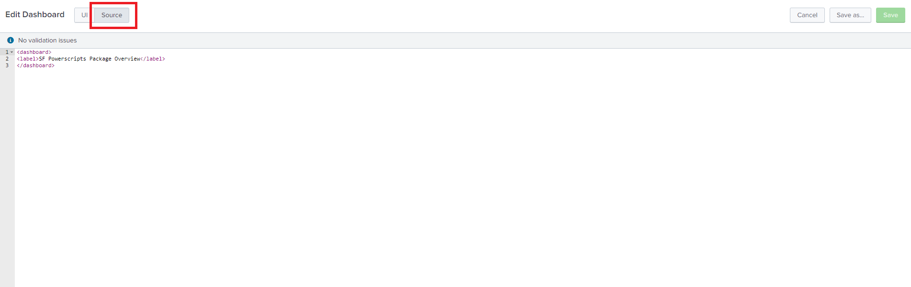
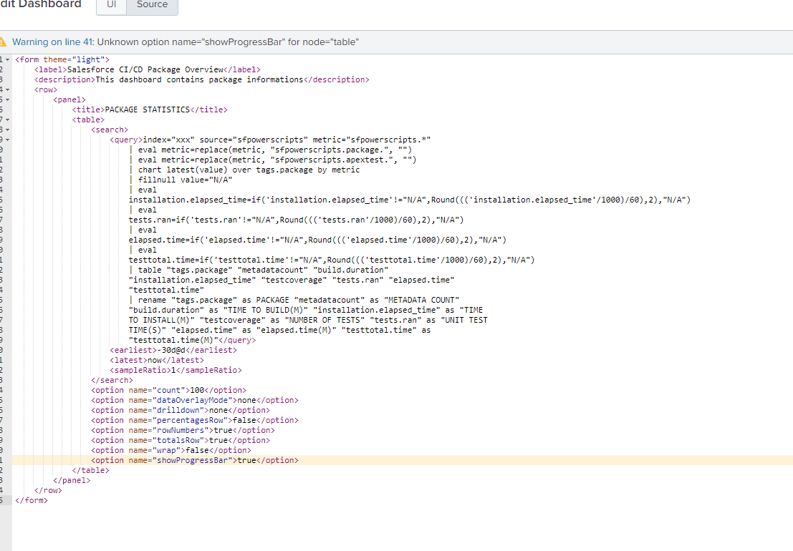
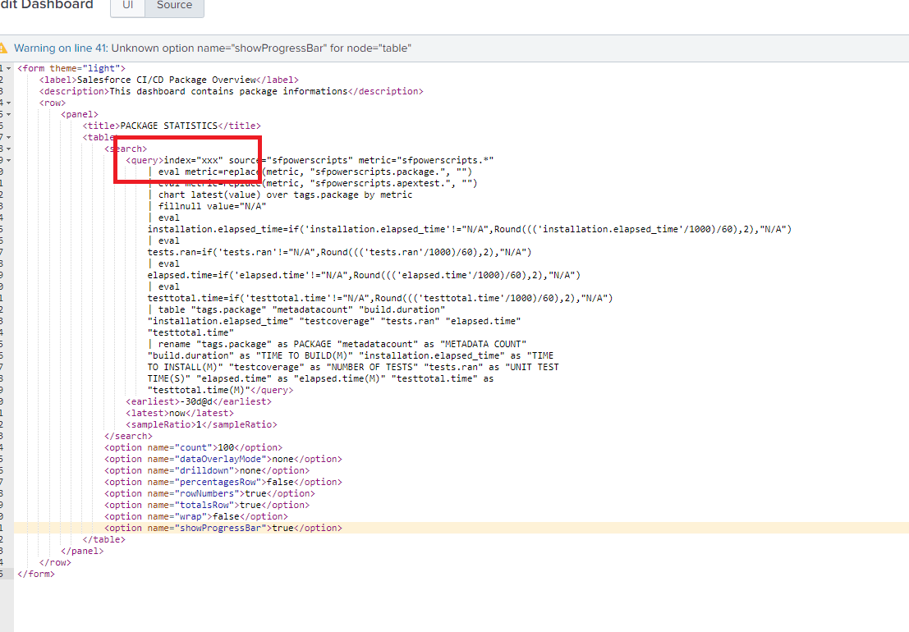
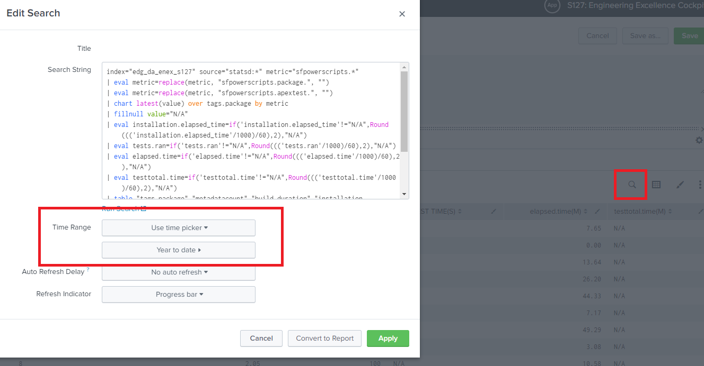

# Splunk

## Git Pipeline Setup

1. Create a "**index**" and "**HEC-Token**" in Splunk.
2.  Copy the **HEC-Token** and create a variable in your pipeline labeled "`SFPOWERSCRIPTS_SPLUNK_API_KEY`" and assign the value of the key. Ensure to mask this value.\\

    <figure><figcaption>
Sample GitLab Variable for Splunk API Key
</figcaption></figure>
3.  Add another additional variable named "`SFPOWERSCRIPTS_SPLUNK`" and set the value to "**true**".\\

    <figure><figcaption>
<strong>SFPOWERSCRIPTS_SPLUNK Variable</strong>
</figcaption></figure>
4.  Copy the full **Splunk Event Collector Url** and create a variable in your pipeline labeled "`SFPOWERSCRIPTS_SPLUNK_HOST`" and assign the value of the url. "**Splunk Url**". Ensure to mask this value.\\

    <figure><figcaption>
<strong>SFPOWERSCRIPTS_SPLUNK_HOST Variable</strong>
</figcaption></figure>

## Dashboard View

1. Navigate in Splunk to **Dashboards** and click **Create New Dashboards**.
2. Create a title and select **Classic Dashboards**.\\

<figure><figcaption>
<strong>Splunk Dashboard Title</strong>
</figcaption></figure>

3. Click on **Source**.\\

<figure><figcaption>
<strong>Splunk Dashboard Source Button</strong>
</figcaption></figure>

4. Choose a splunk xml template from github [dxscale/dxscale-template](https://github.com/dxatscale/dxatscale-template/tree/main/dashboards/Splunk)
5. In this example the **CICD\_PackageOverview**. Copy the contents.\\

<figure><figcaption>
<strong>CICD_PackageOverview.xml</strong>
</figcaption></figure>

6. Paste the xml content in the **Splunk Source Editor**.\\

<figure><figcaption>
<strong>Splunk Source Editor</strong>
</figcaption></figure>

7. Update the source content file value of the **index** for all instances of in the file.\\

<figure><figcaption>
<strong>Change Index Values</strong>
</figcaption></figure>

8.  Update the time range to see all incoming metrics.\\

    <figure><figcaption>
<strong>Change Index Values</strong>
</figcaption></figure>
9. Click Save. 👏
