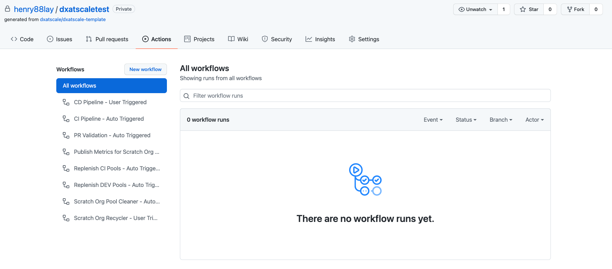

# Solution Overview

## Pipeline Overview



As you can see there are 8 pipelines, we will be going through each one in sequence as you would expect for a typical workflow.

All GitHub actions pipelines are located `YOUR_REPO/.github/workflows/`

### Environment Operations Pipelines

#### Replenish CI Pools - Auto Triggered | `env-operations-prepare-ci-pool.yml`

This pipeline triggers on a daily schedule at midnight, and it will build a pool of prebuilt scratch orgs for your CI pipelines, which include managed packages as well as packages in your repository.

Utilizing sfpowerscripts orchestrator command [prepare](https://sfpowerscripts.dxatscale.io/commands/prepare).

```
sfp orchestrator:prepare --help
```

#### Replenish DEV Pools - Auto Triggered | `env-operations-prepare-dev-pool.yml`

This pipeline triggers on a daily schedule at midnight, and it will build a pool of prebuilt scratch orgs for your developers to work on their own scratch org, which include managed packages as well as packages in your repository.

Utilizing sfpowerscripts orchestrator command [prepare](https://sfpowerscripts.dxatscale.io/commands/prepare).


In order to fetch a scratch org to work on using the sfpowerscripts pool command [fetch](https://sfpowerscripts.dxatscale.io/commands/command-glossary#sfdx-sfpowerscripts-pool-fetch)

`sfdx sfpowerkit:pool:fetch --help`


```
sfp orchestrator:prepare --help
```

#### Scratch Org Pool Cleaner - Auto Scheduled | `env-operations-pool-cleaner.yml`

The pool cleaner pipelines trigger on a daily schedule at 11.00 pm; clean out unused scratch orgs from both CI and Dev Pools, allowing a fresh pool of prebuilt scratch orgs to be created for the following day.

Utilizing sfpowerscripts pool command [delete](https://sfpowerscripts.dxatscale.io/commands/command-glossary#sfdx-sfpowerscripts-pool-delete).

```
sfp pool:delete --help
```

#### Scratch Org Recycler - User Triggered | `env-operations-delete-scratchorg-pool.yml`

This pipeline is manually triggered by the user where you are wanting to delete a particular scratch org pool. A typical use case would be when a developer can't access the scratch org.

```
sfp pool:org:delete --help
```

#### Publish Metrics for Scratch Org Pools | `env-operations-publish-pool-metrics.yml`

This pipeline publishes metrics about the scratch orgs to a Monitoring tool every 30 minutes.

```
sfp pool:metrics:publish --help
```

### Check/Validate Pipeline

#### PR Validation - Auto Triggered | `validate.yml`

Pull request validation, as the name suggests. The validation pipeline will trigger in the main branch. helps you to validate a change made to your configuration or code. within this YAML file, we have three commands running:

Validating package changes using sfpowerscripts orchestrator command [validate](https://sfpowerscripts.dxatscale.io/commands/validate).

```
sfp orchestrator:validate --help
```

Performing a static analysis of Apex classes using the sfpowerscripts analyze command pmd.

```
sfp analyze:pmd --help
```

Validating metadata coverage for unlocked packages using sfpowerkit package command valid.

```
sfdx sfpowerkit:package:valid --help
```

### Continuous Integration Pipeline

#### CI Pipeline - Auto Triggered | `quickbuild-build-deploy.yml`

As developers work through their user stories and committing to their short-lived feature branches, they will be raising pull requests against the main branch; their feature branches will be reviewed and approved, triggering the CI Pipelines:

Within this stage, this YAML file the following sfpowerscripts orchestrator commands in sequence:

* The [quickbuild](https://sfpowerscripts.dxatscale.io/commands/build-and-quickbuild) command will be the packages without triggering dependency validation or code coverage checks.

```
sfp orchestrator:quickbuild --help
```

* The [deploy](https://sfpowerscripts.dxatscale.io/commands/deploy) command removes the overhead of scripting individual package deployments. This will deploy the artifacts to Dev environment. however its dependent on **quickbuild** being successful.

```
sfp orchestrator:deploy --help
```

* The [Build](https://sfpowerscripts.dxatscale.io/commands/build-and-quickbuild) command generates fully validated packages that can be deployed to production. Once packages have been created we can publish build artifacts for publish.

```
sfp orchestrator:build --help
```

* The [Publish](https://sfpowerscripts.dxatscale.io/commands/publish) command publishes the artifacts that were created in build pushing to artifact registry for further utilization by a release pipeline and publishes into an NPM Registry.

```
sfp orchestrator:publish --help
```

### Continuous Delivery Pipeline

#### CD Pipeline - User Triggered | `release.yml`

This CD pipeline, Release Packages, must be manually triggered by the user. It triggers the pipeline for release, orchestrating fetching artifacts from an artifact repository, deploying to an environment including external dependencies, and generating a changelog driven by a release definition file.

Within release.yml this must be manually triggered:

Using the command [release](https://sfpowerscripts.dxatscale.io/commands/publish) will allow you to release to whichever environment you want e.g. ST, SIT, PROD and so on. It will fetch the artifacts published.

```bash
sfp orchestrator:release --help
```
