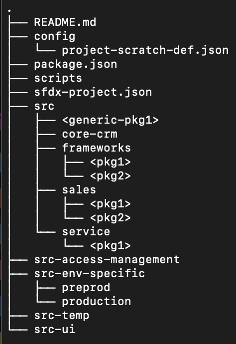
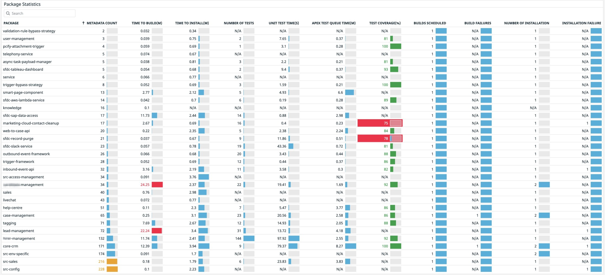
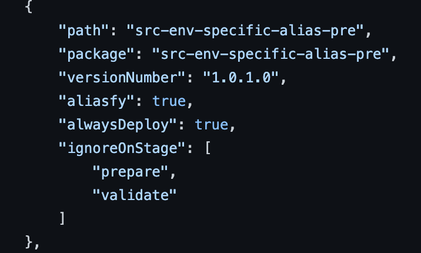

# Adopting Package Based Development Model in Salesforce

With the advent of source tracking on sandboxes, multiple package directory support in Salesforce CLI and Org-Dependent Unlocked Packaging, we need not think any further, everyone can approach package development model with ease by adopting the following techniques and enjoy the benefits of packaging..i.e traceability, automatic management of component lifecycle \(goodbye to those unused components which were not deleted\) and above all, when done properly, feature isolation

#### **Structure your mono repository into domains and packages**

A common approach for package-based development is to have a repo for every package. In our experience, this works well for ISV scenarios or if you are building framework/helper/utilities, however when you are dealing about customizing an org, this doesn’t scale well, as you need to juggle with multiple repositories and manage dependencies.

What we have seen in practice is utilizing a mono repository for your packages brings in a lot of efficiencies. Moving metadata across different packages is easier, as you don't have to raise commits in multiple repositories. Also, you are not building a single app, and not everything is an app either. You are configuring your org across domains with multiple modules, so let's ensure your repository structure denotes that. force-app please stay away!

This is a starter template, we have utilized with lots of success, please note how each package are slotted into each domain and notice the addition of a default folder like src-temp for capturing any new metadata \(a temporary staging area\), which will allow sufficient time to slot components or code into the right folder.

#### More the number the packages... Better is your build/deployment velocity

The bigger the package, chances are it is dependent on a lot of packages, as well as time taken to validate \(if you are using unlocked packages \) and time to deploy increases. The trick is to go full-on with the number of packages, treat packages more like modules, if you think some components can be grouped together if they often change together, it is time to create a package for it.

#### Remove the distinction between package types

Abstract your package type distinctions as much as you can, one example is seen in the above folder structure, it just implies that there are multiple packages and doesn’t distinguish between unlocked, org-dependent or metadata deployment. This allows you to switch between types if required based on parameters such as complexity, the time taken to build and the time taken to install the package to an org.

#### Handle environment-specific metadata with care.

Handle that pesky environment-specific metadata, that contains environment specific and sensitive info such as AuthProviders, ConnectedApps, CustomMetadata \(in most cases\), NamedCredentials by keeping out of the repo. For non-sensitive metadata such as email in Settings file etc, duplicate it per environment \(along with env specific changes\) and deploy it per environment.

Check out the 'aliasify' flag in sfpowerscripts for handling it automatically during deployment. 

#### Build & Install only changed packages into the …not everything, every time!

 Now that you have structured everything into packages \(no matter what type of package\), the next step is to ensure you only build & deploy what is being changed. This can be achieved by utilizing git diffs. Git diffs can be used to understand which packages in the repo are impacted by the change, and then build packages and deploy these packages into the target org.

If you are looking for a toolkit that enables the above techniques, look no further than [sfpowerscripts](https://dxatscale.gitbook.io/sfpowerscripts/), a completely free and open-source solution that can be implemented in any CI/CD system of choice!. 

