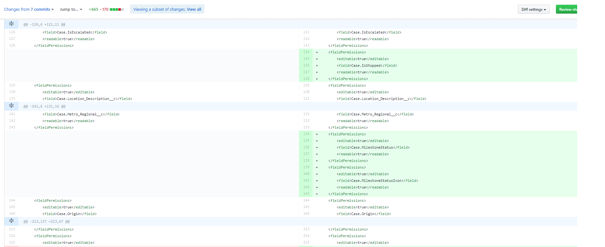
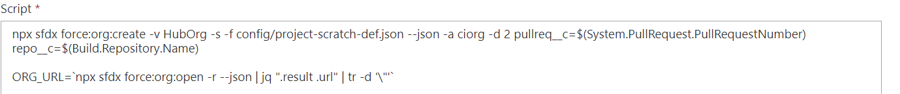
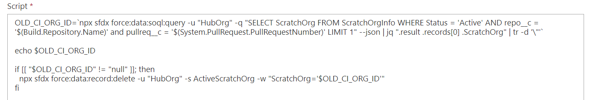
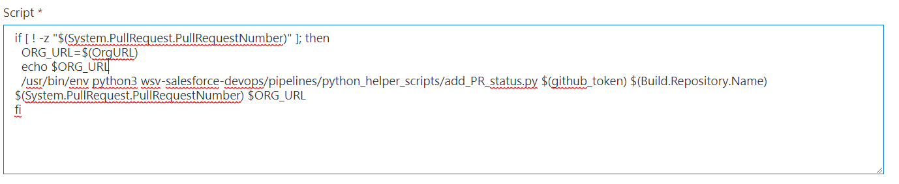
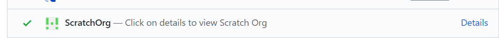

# Effective Pull Reviews in Salesforce DX Development - Persistent CI

Salesforce DX is a combination of technologies and practices that bring modern development practices such as open and standard developer experience driven by a CLI \(Command Line Interface\), Repeatable deployment using packaging, automated testing and predominantly source driven development

 Salesforce DX also provides scratch org which is source driven and disposable deployment of Salesforce code and configuration \(metadata\). Think more of it as similar to spinning a docker container, effectively providing a developer environment for every developer to configure / code. This is a pretty amazing, considering the effort usually a 'DevOps' team spends in creating a docker image for their developer environments, especially when trying to have closed source enterprise grade software. This is Salesforce bringing the power of SaaS and adopting modern tooling.. Kudos to the DX team!

Salesforce development is predominantly UI based configuration, such as defining layouts, custom objects, fields etc known as Metadata along with scripting utilizing a language called Apex. The major factor in success of Salesforce is how much of the development is usually configuration and very little 'custom code'. As Salesforce DX introduces a source driven development, this configuration\(metadata\) which is described in XML is stored in a Source code repository such as GIT.

As I am currently working on a greenfield Salesforce implementation, where we have adopted Salesforce DX and a Git Flow model for development, I along with fellow DevOps engineer [James Smith](https://www.linkedin.com/in/jamesimsmith/) where tracking the pull requests that are being raised, and how effective the peer reviews are. We found that large amount of metadata is generated during configuration and after a successful completion of the story assigned to the developer, a pull request is raised. The metadata is described in XML is pretty verbose and there are changes across multiple files, which makes a review process basically useless, it's more of an approval process before merge to the main branch.

To improve the quality of the review before the branch is being merged to main line, we decided to persist the CI scratch org \(a scratch org is spun up and the merged code is deployed to and any apex/lightning tests are run for validation\), so that the reviewer could login to the scratch created for the pull request, directly from the GIT CI Status , check the feature quickly \(it’s a light review, we have quality engineers embedded who does further testing of all possible routes\), before the branch is merged to the main branch. We nicknamed the feature 'Persistent CI' and this is how you can get it done for your DX implementation. The below scripts uses Azure Pipelines as the CI/CD solution.

1. **Modify Scratch Org Info Object to store the repo and pull request number during the creation of the scratch org**

The Scratch org created for the pull request is kept only for a period of 2 days, after which is deleted, unless a new commit arrives before its killed.

 2.   **To delete any scratch org that is still active based on a previous commit on the pull request, a SOQL query is triggered on the Scratch info object to fetch details of an existing scratch org available on the pull request**    

3. **Submit the URL to as a Github status, we used the Github status API and  a python script for doing it.**

**4. Finally, the moment of truth!**

