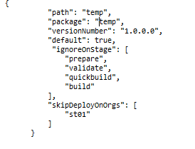

# Elevate your Salesforce deployment experience with just 6 commands

Yes, that's correct, 6 commands is all you need! \(there are some more if you need it\) 😊. We had great fun in implementing an Orchestrator into [sfpowerscripts](https://dxatscale.gitbook.io/sfpowerscripts/) , a sfdx plugin that simplifies salesforce deployment dealing with package based development model. Read on to understand the rationale, and an introduction into these command. 

Orchestrator was born out of the need created by the packaging structure used at one of our programs. This program uses a combination of all kinds of packages \( source, org dependent/unlocked, data\) primarily served from a mono repo. As we started to hit more than 10 packages, the effort to add/modify/disable the commands across validation, build and release pipelines increased tremendously. Though we were already using sfpowerscripts, which makes salesforce packaging pipelines easier, a declarative approach was the need of the hour, one which doesn’t need changes to the pipelines, but rather the pipelines becoming self-aware of what is that need to be built/deployed.  

sfdx-project.json is a manifest which describes a Salesforce DX project. It includes all the packages in a given project in the repo along with its dependencies and other attributes \(like version, name..\) . Adding additional orchestrator properties to the manifest to guide the build process, helped us to improve the whole experience and provided everyone in the team with a clear version controlled view around the behavior of deployment of a package \(type, order, validation \). For eg:, we have a temp package in the repo, which we use only in a developer environment \(may be another day\) and skipped elsewhere. Earlier this information was stored in multiple build YAML files. With the orchestrator's ability to read additional properties, it was unified into a single place.

Orchestrator supports other additional properties, have a look at this [link](https://dxatscale.gitbook.io/sfpowerscripts/faq/orchestrator#hmm-these-orchestrator-contains-pretty-powerful-one-line-commands-will-i-lose-my-flexibility-in-my-pipeline). 

Now let's familiarize each of the individual commands. 

1. [prepare](https://dxatscale.gitbook.io/sfpowerscripts/faq/orchestrator/prepare) \(sfdx sfpowerscripts:orchestrator:prepare\) :  Prepare command helps you to build a pool of prebuilt scratch orgs which include managed packages as well as packages in your repository. This process allows you to considerably cut down time in re-creating a scratch org during validation process when a scratch org is used as Just-in-time CI environment. In simple terms, don't waste time in building a scratch org to validate your changes \( if you are using a PR driven model of merging changes, or to run fast validation checks after your merge.. Like in a pure CI scenario\). This command also have an option to pull artifacts from your artifact repository, so that say you can prebuild your validation orgs, say from tested set of packages. 
2. [validate](https://dxatscale.gitbook.io/sfpowerscripts/faq/orchestrator/validate) \(sfdx sfpowerscripts:orchestrator:validate\): This command goes in pair with the prepare command. It fetches a scratch org from the pool already pre prepared \(by the prepare command\) and deploys/unit tests the changed packages. Please take a note, it tests only the changed packages, so you have a very good chance of detecting the issues as this is the behaviour in your higher environments 
3. [build](https://dxatscale.gitbook.io/sfpowerscripts/faq/orchestrator/build-and-quickbuild) \(sfdx sfpowerscripts:orchestrator:build/quickbuild\) : My fav! This command builds all the packages in parallel wherever possible by understanding your manifest and dependency tree. Goodbye to the sequential builds, where you fail in the n-1th package and have to wait for the next hour. This command brings massive savings to your build\(package creation\) time. Also use the quickbuild variant, which builds unlocked package without dependency check in intermittent stages for faster feedback. And didn't I say it build all types of packages \( source/unlocked/org-dependent/data\) as well. 
4. [deploy](https://dxatscale.gitbook.io/sfpowerscripts/faq/orchestrator/deploy) \(sfdx sfpowerscripts:orchestrator:deploy\): So you have built all the packages, now this command takes care of deploying it, by reading the order of installation as you have specified in your sfdx-project.json. Installs it one by one, deciding to trigger tests etc. and provide you with the logs if anything fails 
5. promote \(sfdx sfpowerscripts:orchestrator:promote\): Now you have done the hard work of building and deploying multiple times and ready to hit production, this command promotes all the unlocked packages that you have built so far. 
6. Publish \(sfdx sfpowerscripts:orchestrator:publish\) : What good is your pipeline, if it doesn't publish artifacts to an artifact repository? Provide a script to publish an artifact to this command, and let it publish all the artifacts to your preferred artifact provider.  

Want to see all this in action, head to the sample pipelines in the link [here](https://github.com/dxatscale/easy-spaces-lwc/tree/develop/.github/workflows) and read more about the orchestrator in the [docs](https://dxatscale.gitbook.io/sfpowerscripts/faq/orchestrator). 

