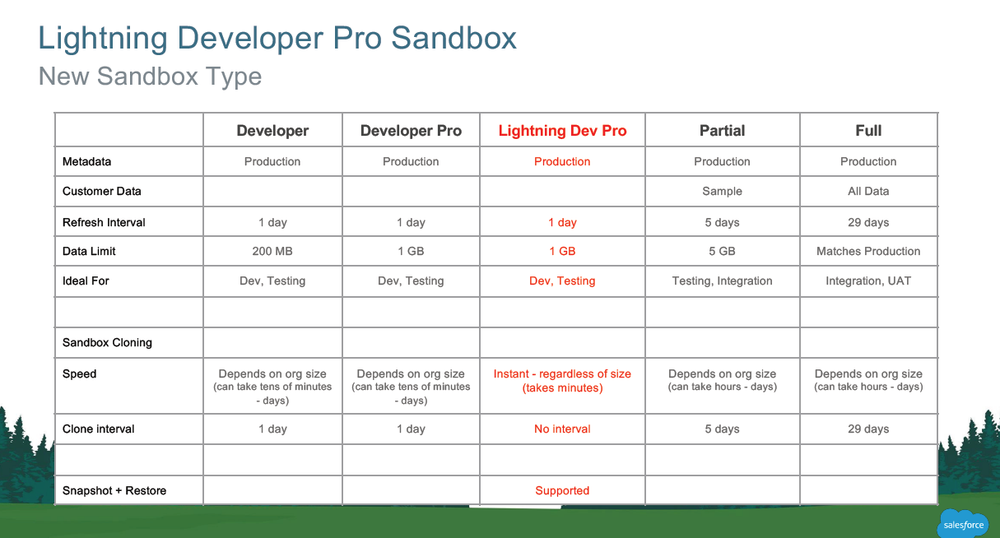

# The soon to be state of DevOps for Salesforce

This is a purely speculative article, based on the current chatter in the Salesforce community, blog posts from the product team and connecting the dots to give a general idea on what we should expect in the next few releases.

#### Declarative Configuration Management of Settings and Features

If you have used scratch org's, you are already familiar with config/project-scratch-def.json or the Scratch Org Definition file \( [https://developer.salesforce.com/docs/atlas.en-us.sfdx\_dev.meta/sfdx\_dev/sfdx\_dev\_scratch\_orgs\_def\_file.htm](https://developer.salesforce.com/docs/atlas.en-us.sfdx_dev.meta/sfdx_dev/sfdx_dev_scratch_orgs_def_file.htm)\). This definition file is used to enable the shape of the scratch org during a development cycle. It is expected by the Winter 20, all the features and settings will be available through scratch org definition file \([https://developer.salesforce.com/blogs/2019/02/features-and-settings-and-scratch-orgs-oh-my.html](https://developer.salesforce.com/blogs/2019/02/features-and-settings-and-scratch-orgs-oh-my.html)\)

Salesforce DX product team is actively working on the Shape Org feature \(which is currently in pilot\), which helps in importing all the feature that is currently turned on in a Production Org. This helps in creating a scratch org with all the features/settings currently in production. The shape org pilot also has a cool feature, where another org can link to the shape of an existing org. This can be helpful for vendor's and partner to debug why a second generation package is not behaving properly in the target org or even develop a package using the vendor/partner's scratch org resources and then deliver the package to the target org.

I believe the team will soon tackle configuration management of the Salesforce environment such as a sandbox using a similar approach to the declarative configuration of settings

#### Improvements to Change Lead Time

I have in the previous [blog](https://www.linkedin.com/pulse/change-lead-time-dx-unlocked-packaging-azlam-abdulsalam/) explained the average lead time for DX Unlocked packaging especially when it involves any dependencies with large managed packages. Snapshot feature \(soon to be in pilot \) will enable one to define a snapshot with dependent managed packages. This will enable to provision a scratch org with the dependencies as quickly as creating an empty one. The other improvements in the pipeline include defining a transaction with multiple package installation, to reduce apex compile time and prevent deployment errors.

There are also multiple improvements in the pipeline for different kinds of metadata to make it compatible with the CI/CD flow, such as Lightning Communities with Experience Bundle \([ https://releasenotes.docs.salesforce.com/en-us/summer19/release-notes/rn\_networks\_developers\_exp.htm](http://%20https//releasenotes.docs.salesforce.com/en-us/summer19/release-notes/rn_networks_developers_exp.htm)\), deprecation of flow definitions in v45 and much more.

#### Multi-Tenant Architecture meeting Virtualized Infrastructure

Salesforce has been adopting Kubernetes on a large scale across its data centres and moving their monolithic architecture to microservices. Scratch Org's are believed to be a salesforce container running on Kubernetes Pod and this is what enabling the faster provisioning. Dreamforce 2018 introduced us to a pilot of Lightning Dev Pro Sandbox, which is a turbocharged scratch org \( 200 MB Data vs 1 GB\) and can be the perfect fit for Development / Testing or use in a CI environment where more data set is needed. Also snapshot feature for Sandboxes are also exciting, as it allows to create sandboxes from a specific point in time

####  CLI Improvements across the board .. And embracing Open Development

Salesforce CLI is consistently improving every sprint and every release. The CLI is based on Heroku oclif which makes it easy to create plugins and provide a consistent experience. Salesforce DX team has repeatedly mentioned they will be shortly open sourcing the CLI and already provides a GitHub issue registry for community feedback \( [https://github.com/forcedotcom/cli](https://github.com/forcedotcom/cli)\). Salesforce has recently also open sourced intra org data migration \( [https://developer.salesforce.com/blogs/2019/03/open-sourcing-salesforce-intra-org-data-migrator-tool-datafall.html](https://developer.salesforce.com/blogs/2019/03/open-sourcing-salesforce-intra-org-data-migrator-tool-datafall.html)\). I expect many more improvements to happen in the data space using CLI's.

The latest additions in Summer 19 include beta commands to create a sandbox and authenticate to the sandbox directly from the cli, using the similar experience of scratch org. The DX team has shared that they are planning to allow authentication to the sandbox provide you have access to DevHub, which is a common issue in Ops providing access.

#### Emphasis on Microservices based architecture for faster releases and reduced maintenance

One of the common needs for teams adopting a DevOps culture is the need to reduce coupling and increase the release velocity. Adopting an event-driven architecture helps in achieving this. Winter 19 GA'd the High-Volume platform events which help in achieving this style of architecture. Also, the acquisition of Mulesoft will help Salesforce push in utilizing it's out of the box connectors to connect disparate systems faster. I expect a slew of new trailhead chapters and videos on how different organizations are already achieving this or the best practices in this area.

I believe this is an exciting space to keep a lookout for and can't wait to see the what next releases bring in.  

