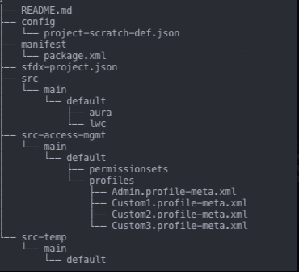

# Version Controlling Profiles and Why It Makes Sense for Deployments?

Profiles have long been a sore spot for Salesforce professionals to deploy, manage, and keep in sync across all environments. Although Salesforce is pushing to move to a more **Permission Set/Permission Set Group** centric model to customers, the truth is that Profiles, for most organizations, are not going to go away any time soon. Profiles serve as the security foundation to define what users can have access to within the Salesforce application as well as to core system permissions. There are still a handful of features such as **Default Record Type, Page Layouts, Login Hours & IP Ranges** that can only be configured through Profiles and not available through Permission sets. As a result, this is the one of the reasons why Profiles will continue to be a mainstay feature to your overall Security Design in Salesforce. 

Due to the ease of point-and-click configuration in Salesforce, adding or removing permissions for a Profile is simple. It's managing a constant influx of changes during each sprint or release, across multiple environments that make Profiles a nightmare for most companies to manage. There are many commercial DevOps tools and ISV Managed Packages in the market place that seek to provide insights and visibility to Profile discrepancies across environments. Some of these tools also have in addition to comparison features, their own native solution to synchronize the changes. From my experience, another option to handle this is through source control, source packaging via SFDX and open source cli plugin extensions.

Organizing your metadata in your production org can be a daunting task and there are a number of articles and point of views out there describing how you can embark on that journey to modularization and unlocked packaging. One metadata area to start when examining what makes sense to package first are Profiles. This will create a single, source of truth for Profiles in your version control system. It help alleviate environment permission discrepancies most teams face over the course of their projects. Not only will you have a complete history of changes for your profiles as they grow in size, but it will empower your release managers with the confidence that they are deploying the most up to date "package" of Profiles \(and or Permission Sets\) across environments. Deployment of the profile packages can be done via source or mdapi deployment commands from the SFDX CLI. If you are looking to for more advanced open-source orchestration tools to facilitate the deployment, there are options too some links below for more information. Either way, with the packaging of profiles and/or permission sets under the "**access management**" packaging concept, you will improve your development and operational workflows and get one step closer to the modularization of your metadata. This is the future of Salesforce Development Best Practices and there is no better opportunity than now to get started.

SFDX CLI provides you some commands to retrieve Profiles via the mdapi or source retrieve commands.

```text
sfdx force:mdapi:retrieve
```

* Uses Metadata API to retrieve a .zip of XML files that represent metadata from the targeted org

```text
sfdx force:source:retrieve -m "Profile:My Profile"
```

* Retrieves metadata in source format from an org to your local Salesforce DX project

The limitations for these standard SFDX command for Profile retrieval is they are limited to the contents of metadata stored in the source repository and/or the completeness of the manifest file pass as a parameter. If you are dependent on capturing all access permissions to standard objects or metadata within managed packages, the native CLI commands will not capture these in the generated profile metadata file. Also, the source and mdapi retrieve commands may extract additional user permissions in the profiles that potentially cause deployment validation failures across target sandboxes and scratch orgs that do not support the permissions. This is where the open source community comes into play.

The two plugin commands that have proven invaluable to managing profiles are **sfpowerkit:source:profile:retrieve** and **sfpowerkit:source:profile:reconcile**. Underneath the hood, the **retrieve** command utilizes the underlying Salesforce Metadata API and data model to query and identify metadata in the target orgs. Once the list has been retrieved, it generates a full profile file comprising of the following supported metadata types: **ApexClass, CustomApplication, CustomObject, CustomField, Layout, ApexPage, CustomTab, RecordType, SystemPermissions**. The **reconcile** command takes the output profile file generated from the retrieve command and then goes through a series of steps to cleanse the file of metadata items that are not present in the target org. This automation ensures that you have a profile metadata file that is in a deployable state to your target org.

Once this file is validated to the target org, it can be baseline in your source repository to ensure future additions and modifications are tracked. Repeat the process over again each time you want to obtain a complete set of permissions from your source of truth org for Profiles \(eg. Production initially or Developer Sandboxes for new development going forward\). You now have the option to leverage the retrieve and reconcile commands to get the latest updates from your shared development environment or incrementally merge additional permissions to the profiles during the course of your agile development process.  

Please note that each time you modify the profiles, whether through tooling or manually modifying the metadata file, the entire profile is saved and not a subset of permissions in the Profile metadata. Having delta snippets of Profiles defeats the purpose of maintaining a complete set of permissions in your Profile package for deployments. There is no need to create an unlocked package for the profiles here as it needs to be treated as separate deployable "**source package**" state that is not managed by default by the Salesforce Dev Hub. There are more advance topics on these types of "[source packages](https://dxatscale.gitbook.io/sfpowerscripts/faq/source-packages)" that I recommend to review further.  

#### **Quick Starter Guide for Initial Profile Package**

1 - Create your default SFDX project in source format.

2 - In your _sfdx-project.json_ file, create two packages called "**src-temp**" \(Set to Default\) and "**src-access-mgmt**". \(**Note**: This name is completely up to you but after going through multiple iterations and permutations, it's the name that has stuck with me on my last few projects for the two packages. The "**src-temp**" folder serves as staging folder for metadata retrieved\).

3 - Retrieve a baseline of all the profile from Production that you need to track and deploy across environments. At a minimum, this typically consists of your Admin Profile, an Integration Profile, and some additional cloned Standard User Profiles that you have created for your applications in Salesforce.

```text
sfdx sfpowerkit:source:profile:retrieve -n "Admin, Custom1, Custom2, Custom3" -u orgAlias
```

4 - The profiles will be retrieved to your default package directory, in this case, "**src-temp**". Move the profiles files to the "**src-access-mgmt**" folder after as this will be the home for the profiles for deployments.

5 - Create a new Developer Sandbox from Production and attempt to validate the package to new sandbox.

```text
sfdx force:source:deploy -u newDevOrg -c -p src-access-mgmt -w 30 --testlevel=RunLocalTests
```

6 - If there are errors, use the reconcile command to cleanse the profile file to a deployable state.

```text
sfdx sfpowerkit:source:profile:reconcile -u newDevOrg -f src-access-mgmt/main/default/profiles -n "Admin, Custom1, Custom2, Custom3"
```

7 - Commit your code to your repository to baseline the set of profiles.

8 - Voila, you have now a source package that contains your profiles to deploy consistently across multiple environments.

#### **Sample SFDX Project Folder**



#### **Some Guiding Principles to Leave You With**

1. **Principle of Least Privilege** - Users should have the least number of permissions necessary to do their job and nothing more.
2. Deploy metadata that is new to your target org first before doing a reconcile. If you forget to this, no new permissions will be deployed with the profile file.
3. Refresh environments frequently and deploy your complete set of profiles via source packaging to ensure they are in a deployable state.
4. Avoid storing **Login IP Ranges** in the Profile metadata file. This should be set manually in Production and should not be changed unless there is a strong requirement to update them.
5. Where possible, move start looking to migration permissions to Permission Sets for role based permissions to layer your access management controls for stackable, flexible, and easier assignments to users. This will help you future proof your organization as Salesforce continues to release updates and support for Permission Sets across more metadata types.
6. Try it. If you end up not liking this approach, you can always go back to what you are used to.

Hopefully this blog gets you started on your journey to **DevOps Maturity** and packaging modulation for Salesforce. Below are some additional reference articles and videos that you can review further to deepen your understanding of profiles, permission sets, and the open source tools in the marketplace to enable you to be successful. 

#### References

* [Salesforce Profile Help Article Reference](https://help.salesforce.com/articleView?id=sf.admin_userprofiles.htm&type=5)
* [User Profile permission descriptions](https://help.salesforce.com/articleView?id=000332385&type=1&mode=1)
* [Admin's Guide to Profiles & Permissions](https://www.youtube.com/watch?v=7SLxHuc68x8)
* [SFDX sfpowerkit plugin](https://github.com/Accenture/sfpowerkit)
* [sfpowerscripts](https://dxatscale.gitbook.io/sfpowerscripts/)

All opinions are my own in this article are of my own and based on experiences using the tools and frameworks out there. Enjoy your DevOps Journey!

