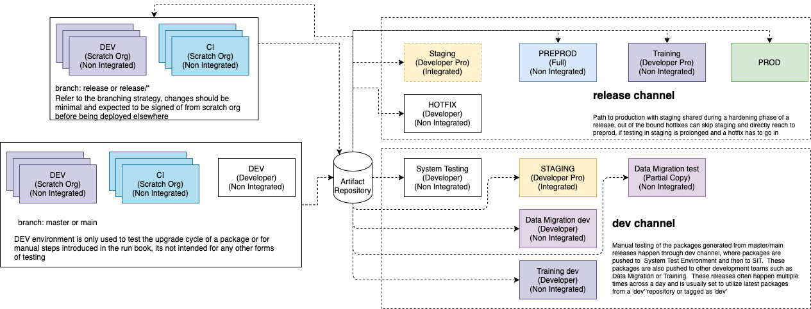

# Releasing to an Environment

A release is a set of packages \(or artifacts\) and their dependencies being deployed to an environment.  Releases are defined using a YAML file definition and orchestrated by sfpowerscripts. Read more about the release definition [here](https://dxatscale.gitbook.io/sfpowerscripts/commands/release).

DX@Scale is typically applied to enterprise development, where you have **major releases**, which can be either a combination of a couple or more sprints, usually developed in the trunk and run through various stages of testing before hitting production or **minor release \(quick release\),** which is changes to say a layout or a hotfix and have a fast-tracked release process.  
  
Assuming you are following the release model mentioned below, there will be artifacts that are generated from the trunk \(dev channel\) which will be tested in the day-to-day cycle, and once it is satisfactorily tested, a release branch is cut to release to production.  Please check the [branching model ](../scm/branching-model/)and [environment strategy](../environment/env-strategy.md) to understand it further.   

  

For every major release, we ask you to define an individual release definition file, the release definition should have the name of the release and a list of the packages that are planned during the phase. The release definition will typically have the artifacts pointing to the **LATEST\_TAG** \(implies that it utilizes the latest git tags filtered to the branch if the release definition exists on the same branch as of the code base\)

1. **Releases from the dev channel** These are releases composed of artifacts from the trunk \(main\) and is quite frequent, often multiple times throughout a day. The release pipelines could be designed to be either on a scheduled interval or could be triggered on demand as required.   
2. **Releases from the release channel** Once release is cut from a particular commit id from the develop branch, the release definition based on **LATEST\_TAG** or **exact version** is utilized to form the release. The release pipelines are triggered on demand.

#### Activities during a Release to non-prod environment

1. Execute Pre Runbook for the particular release
2. Trigger Release from your CI/CD Platform
3. Execute Post Runbook for the particular release
4. Conduct Post verification test of your release in the particular environment

#### Activities during a Release to Prod environment

1. Trigger a dry run of the release using release command with `--dryrun` feature, so that it displays the artifacts, work items and commits that form the particular release. Ensure all of the work items are tested and signed off previously in your ALM application, 
2. Execute Pre Runbook for the particular release
3. Trigger Release from your CI/CD Platform
4. Execute Post Runbook for the particular release
5. Conduct Post verification test of your release


DX@Scale practitioners follow a concept of deployment budget, that is a deployment as part of the release should not take more than an hour \(for minor releases\) and more than three retries to an org. If it takes more than three retries the release should be abandoned


#### 

