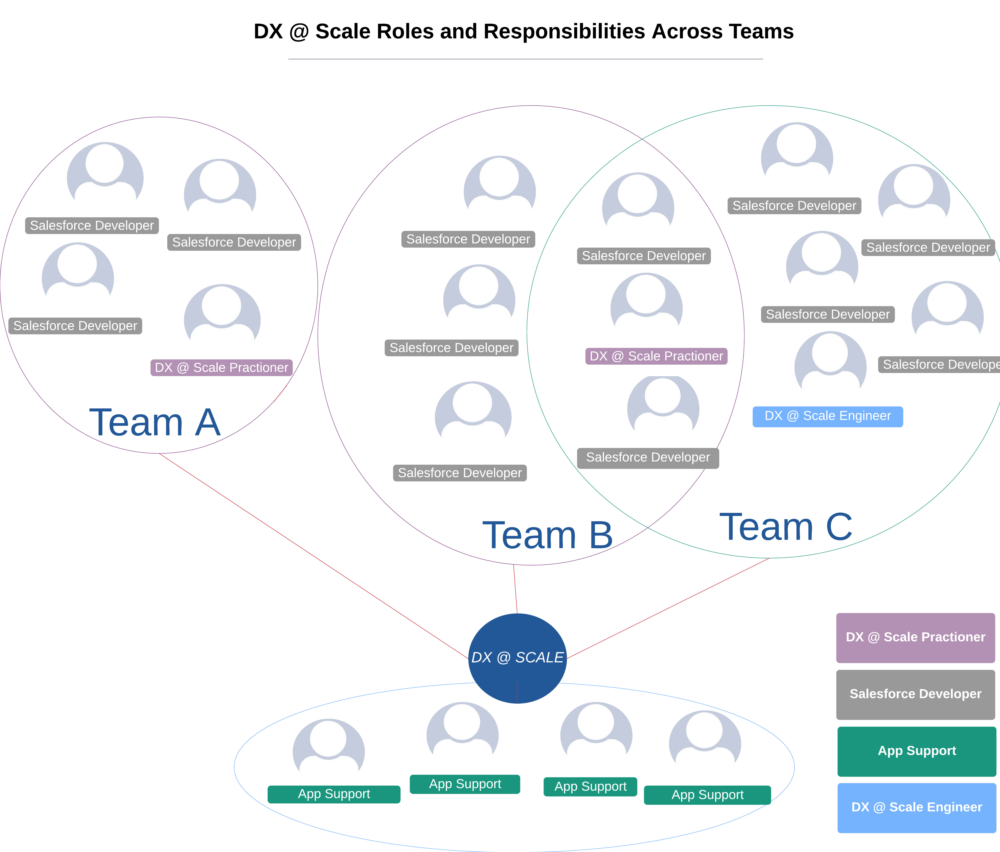

# Team Structure and Roles

## DX@Scale Practitioners

#### Description

DX@Scale practitioners are seasoned developers who understand what DevOps on Salesforce is about, **Application Architecture**. They follow software engineering principles and are deeply familiar with Salesforce DX and Packaging.

A DX@Scale practitioner helps the whole team adopt a DevOps culture, where the team is responsible for the path to production. A project should have at least one DX@Scale practitioner full time.

#### Key Skills

* Lead a cross-functional team to examine and translate business requirements into a solution using Salesforce capabilities
* Implement highly maintainable Salesforce solutions and perform peer code reviews to ensure the same.
* Participate in development work streams, from design through testing and deployment.
* Maintain effective client relationships, delivering timely and relevant information with the ability to quickly identify and report project risks.
* Work with other developers, designers, and architects to ensure the build meets business requirements and performance goals.
* Understanding of Salesforce DX and version control
* Strong knowledge of DX@Scale practices
* Knowledge of the differences between CI and CD
* Experience with modular application architecture
* Participate in ‘Go-Live’ support and testing activities
* Passionate for continuous improvement, automation, and never accepting the status quo for DevOps

## Salesforce Developers

#### Description

Salesforce Developers are team members either from a functional or technical background who along with DX@Scale practitioners are responsible for developing features in Salesforce by utilizing software engineering principles and writing testable and deployable code/config. Salesforce Developers in a DX@Scale project is responsible for collaborating with Application Support teams and deploying packages to production

#### Key Skills

* Equivalent Salesforce Development Experience
* Understanding of Salesforce DX and version control
* Participate in ‘Go-Live’ support and testing activities

## Application Support Team

#### Description

Application support team are responsible for maintaining salesforce production \(includes all the operational activities in a salesforce org \) rolling out hot fixes and maintaining the health of the org.

#### Key Skills

* Equivalent Salesforce Development Experience typically an Advanced Salesforce Administrator
* Environment Management
* Support Development Teams in orchestrating releases if required.
* Understanding of Salesforce DX and version control
* Participate in ‘Go-Live’ support and testing activities

## DX@Scale Engineers

#### Description

A DX@Scale engineer will be able to define and implement a DX@Scale pipeline that fits the project’s needs \(branching model, environment strategy, deployment pipeline, release definitions\)

DX@Scale engineer will maintain and monitor the pipeline but will not be responsible for release orchestration.​​ Every project doesn't need a full time DX@Scale Engineer.  Either one of the team members who has the below skills can play the role of a DX@Scale Engineer 

#### Key Skills

* Strong know how on Salesforce Development Lifecycle​
* Salesforce Plugin Development using Typescript/Node.js​
* Authoring CI/CD pipelines​
* Understands DevOps tools such as Artifact Registry, Docker Image and comfortable with YAML

## Team Structure

DX@Scale works with various team structures. One of the most successful team structure is depicted below

