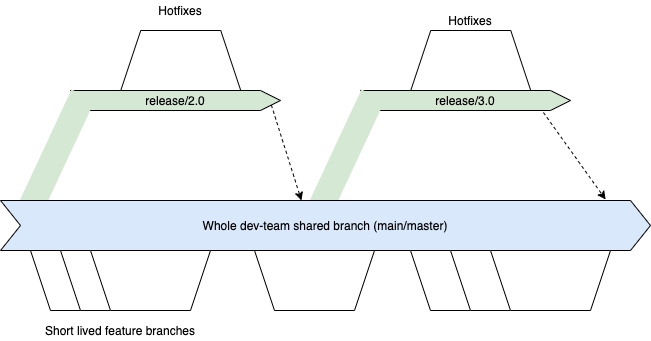

# Branching Model

DX@Scale follows a slightly modified version of Scaled Trunk Based Development. 

To understand it further, let's understand the original scaled trunk based development.

### Scaled Trunk Based Development

In [Scaled Trunk Based Development](https://trunkbaseddevelopment.com/), developers utilize short-lived feature branches, where an individual developer work on a very small piece of functionality. Once it is tested properly, the developer would raise a Pull Request to be integrated into the trunk **\("main"\)** branch. If the pull request validation is completed successfully and the reviewers are happy with the change, it is immediately merged into the trunk. 

Release branches are cut from trunk at a point in time, some days ahead before the release is ready to be deployed to production. This branch is typically cut to harden the release, especially minor bug fixes etc. The key thing to be noted here is developers are not allowed to merge to release branches directly. They are only allowed to merge to trunk \("**main**"\) branch and [cherry pick ](https://www.atlassian.com/git/tutorials/cherry-pick)the changes to the respective release branch.

#### DX@Scale Branching Model

DX@Scale follows the **scaled trunk based** branching model, with only caveat being we allow developers to commit changes to a release branch. This is based on our experience working with a large number of Salesforce programs in certain scenarios.


**Please note, commits to release branch is only allowed in a large program where you have a larger team and the trunk has immediately switched to the items in next release and the time difference between releases are very significant.**



Development teams should strive to follow a scaled trunk based development as much as possible.  Commits on release branches often results in merge complexities if not frequently merged back to trunk. Read more about it [here](https://trunkbaseddevelopment.com/branch-for-release/). We only allow this considering Salesforce Development typically doesn't align well with techniques that are suitable for code based platforms and on a large scale transformation scenario, the releases are spaced out by a few months 


### Handling Concurrent Releases

Having concurrent releases in a large program is inevitable due to a variety of reasons, such as alignment to different business units, time taken to develop a feature, etc.

> "Your company wants a stream of major functionality to arrive in the application you are pushing live at a regular cadence. Because you are good Extreme Programmers, you know that consecutive development of consecutive releases is best. However, the effort and length of time needed to complete each major piece of functionality is large enough to require different project teams cooperating towards that plan. Some of those teams will be within the same codebase. Some may be dependent services that the application will invoke over the wire. Not everything is equal effort it seems, yet the business wants a specific rollout, including dates and can plan that even eighteen months ahead. They are very specific because there is an impact on the user community \(staff, clients, customers or members of the public\). Driving departments may include training, marketing, finance." -- Paul Hammant@trunkbaseddevelopment.com

The following approaches are recommended 

#### 1. Shifting the Order of Releases

The best plan of action to handle concurrent release strategy is not to handle it all, by trying to shift the order of the deployments in a way that could be done in a sequence. If that approach is not feasible, one should look into the below options

#### 2. Branch by Packaging

If the components that are being developed, could be segmented into a new package and ensuring the package doesn't get deployed is an alternate option to using branches in version control.

**3. Feature Toggling**

Read more about how feature toggling could be applied in Salesforce development in the [next section](feature-toggling.md)

4. **Branch by Abstraction**

Branch by abstraction is a technique that is commonly used in Continuous Delivery. This technique is detailed in many articles. Some links are the following

1. Branch By Abstraction - [trunkbasedevelopment.com](https://trunkbaseddevelopment.com/branch-by-abstraction/)
2. Branch By Abstraction by Martin Fowler - [https://martinfowler.com/bliki/BranchByAbstraction.html](https://martinfowler.com/bliki/BranchByAbstraction.html)

