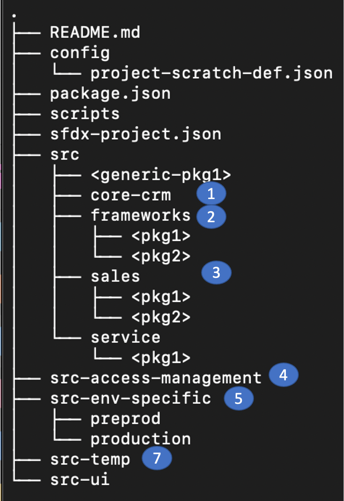

# Repository Structure

DX@Scale projects predominantly follow a multiple mono-repo structure similar to the picture shown above.  Each repository has as src folder that holds one or more packages.

Different folders in each of the structure are explained as below

1. **core-crm:**  A folder to house all the core model of your org which is shared with all other domains
2. **frameworks:** This folder houses multiple packages which are basically utilities/technical frameworks  such as Trigger, Logging and Error Handling, Dependency Injection etc.
3. **sales:**  An example of a domain in your org. Under this particular domain, multiple packages that belong to the domain are included
4. **src-access-management:**  This package is typically one of the packages that is deployed second to last in the deployment order and used to store profiles and permission sets that are applied across the org
5. **src-env-specific:** An aliasified packaged which carries metadata for each particular stage of your path to production.  Some examples include named credentials, remote site settings, web links, etc 


src-env-specific should be added to .forceignore files and should not be deployed to a scratch org.   


7. **src-temp :** This folder is marked as the default folder in sfdx-project.json This is the landing folder for all metadata and this particular folder doesnt get deployed anywhere other than a developers scratch org. This place is utilized to decide where the new metadata should be placed into. 

This will form your initial structure of packaging. Once some development cycles are being completed,  frameworks can be moved into its own repository.  If you also figure a particular domain is being not iterated upon frequently anymore and there are no upward dependency, they could also be removed into another repository.

