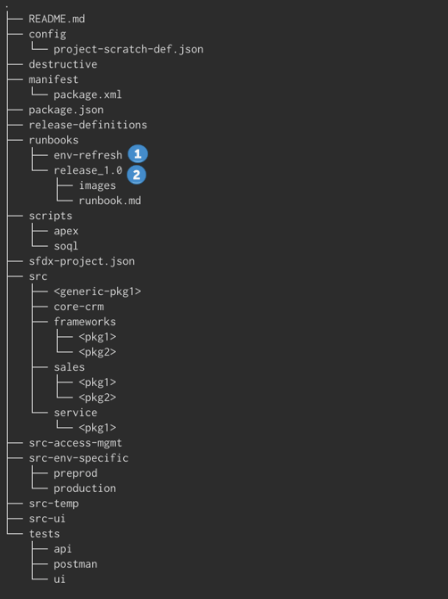

# Tracking Manual Steps

#### 

Salesforce API surface has been steadily increasing over the years, however, there are still gaps around various components, which need to be manually enabled for deployment to succeed.  Typically these manual steps are tracked in excel sheets or as a document in confluence or any other system outside the version control.

### Runbooks Managed in Source Code Repository

In the DX@Scale model, manual steps are managed in version control in the same repository along with any other packages. It also has the same importance of code/configuration that is being version controlled.

The following structure is advised for every DX@Scale implementation



The repository need to contain a folder called _**runbooks**_, with the following sub-folders

**\(1\) env-refresh :**  This folder contains at least 1 file in markdown format that contains the manual steps taken after a sandbox is refreshed. Depending on the sandbox type, there maybe the need to separate env-refresh run books for sandboxes that contain data \(Partial/Full\) and sandboxes that are purely metadata \(eg. Developer/Developer Pro\).  

Some examples of manual steps to document are:

* Email Deliverability
* User Activations
* Org Specific Settings \(eg. Remote Site Settings\) 
* Custom Settings
* Connected Apps
* Named Credentials
* WebLinks

**\(2\) release-X** : Each release needs to have a dedicated folder with the name of the release. It needs to have two files in markdown format titled _runbookpost.md_ and _runbook\_pre.md._ These files will track any steps that need to be done before a release and after a release into an environment.  Alternatively, you can make one consolidate markdown file and separate the pre and post runbook steps.


Any addition to the run book should be carefully reviewed and ascertained that it is indeed a manual step during the pull request validation process.  If it is a recurring step, all effort should be taken to avoid it, including changing the design.



Screenshots referenced in the runbooks should be stored in the `images`folder and will increase the size of the repository.  If required, older releases can be archived and removed from the repository to reduce the size.


### Template for Run Books



### Release 0.3 - Pre Run Once

This document outlines the steps that are required to be run once in each environment we are deploying to.

1. Start the Async Batch Processor \(As the System User\)." - Developer Console &gt; Debug &gt; Open Execute Anonymous Window - Execute the following code

```text
AsyncProcessorBatch.start();
```

| Environment | Completed | By | Date |
| :--- | :--- | :--- | :--- |
| ST01 | X |  |  |
| DEV | X |  |  |
| DM | X |  |  |
| DEV TRAINING | X |  |  |
| STAGING | X |  |  |
| PROD |  |  |  |



