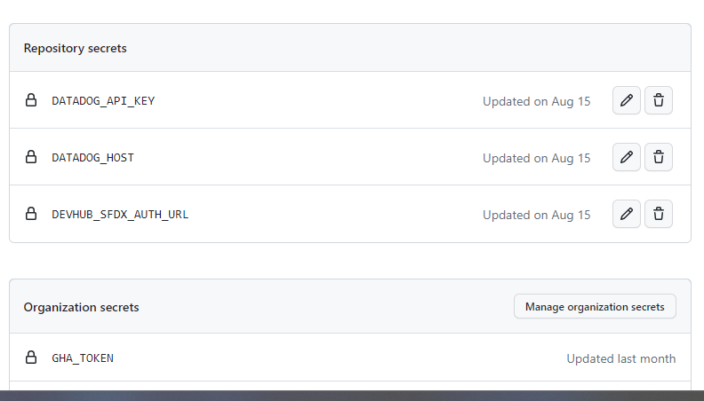
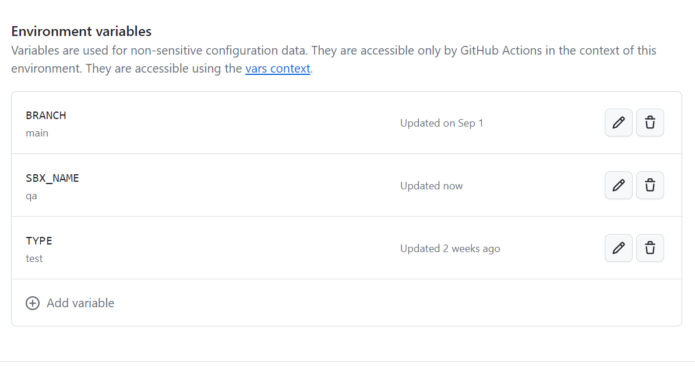
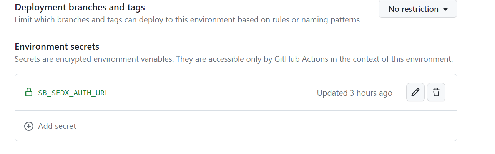

---
layout:
  title:
    visible: true
  description:
    visible: false
  tableOfContents:
    visible: true
  outline:
    visible: true
  pagination:
    visible: true
---

# Authenticating to Environments

Environments in sfops are authenticated using the credentials stored in Github. This section describes the various mechanisms used for authenticating environments\

## Authenticating to  Dev Hub

Dev Hub is critical aspect while developing on Salesforce. Dev Hub comprises of  objects with permissions that allow developers and admins to create scratch orgs, second generation  packages and view various information about the same.  You can read more about enabling Dev Hub [here ](../../implementing-your-ci-cd/getting-started/getting-started-1.md#a.-enable-dev-hub)and other pre-requisites. Once you have generated SFDX\_AUTH\_URL for your org that holds Dev Hub, it need to be added to 'Repository Secrets' of your Repo\
\
The repository secret has to be named with DEVHUB\_SFDX\_AUTH\_URL and the the generated SFDX\_AUTH\_URL need to be added to this secret.\

<figure><figcaption>
DEVHUB_SFDX_AUTH_URL added as repository secret   
</figcaption></figure>

### Authenticating to  Production

If your dev hub and production is on the same org, you do not have to create any additional secrets  in the Github Environment 'PROD'. If its different, you need to create a new  environment secret titled 'SFDX\_AUTH\_URL' and add the equivalent value.

### Authenticating to Sandboxes

Authenticating to Sandboxes depends on how is the sandbox being created\
\
1\.  **Sandboxes created by  same production user configured in GitHub**

Sandboxes created by the same production user can be authenticated  by using the sandbox name, all that is required is the use of setting up the SBX\_NAME variable in environment as shown below\

<figure><figcaption>
Use of SBX_NAME in Authentication
</figcaption></figure>


Please note, when a sandbox is refreshed from the UI or using CLI,  irrespective of whether the action was done by the user configured in Github,  sfops will not be able to authenticate to this environment, and you will need to provide SB\_SFDX\_AUTH\_URL  as mentioned in #2.


2.  **Sandboxes created by  any other users in production**\
    \
    To authenticate a sandbox that was not created by the configured user in Github, one needs to provide a environment secret **SB\_SFDX\_AUTH\_URL** which can be obtained by using the instructions [here](../../implementing-your-ci-cd/getting-started/getting-started-1.md#g.-authenticate-to-lower-sandbox-environments-via-cli).\
    \

    <figure><figcaption></figcaption></figure>

