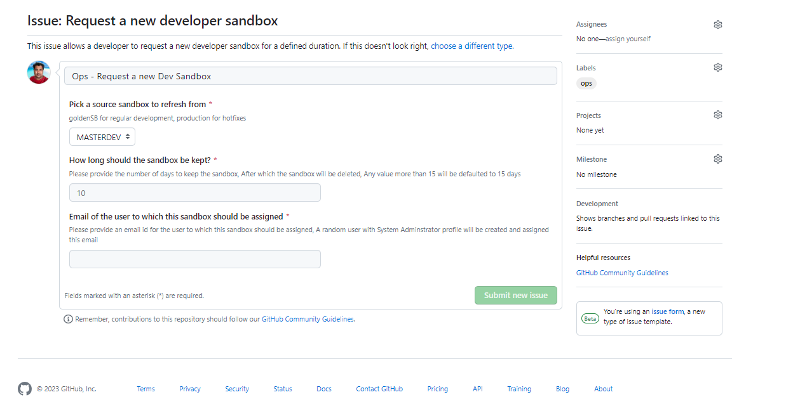
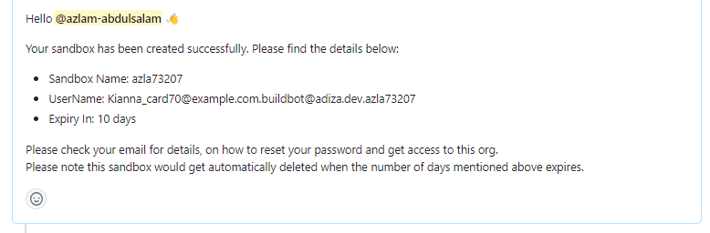

# Request a new developer sandbox

This issue allows a developer to request for a developer sandbox to carry out development\
\

<figure><figcaption></figcaption></figure>

The   developers have the option to pick a source sandbox.  If the source sandbox is anything other than production, the developer sandbox will be cloned from the provided source sandbox. The sandboxes created will be kept for a maximum of 15 days or the number of days the developer has specified (whichever is lesser).\
\
Upon successful creation of a sandbox the requested user will receive an email with a reset password for the particular sandbox. The issue will be also updated with the status of the username and the duration of days upon which the sandbox will be deleted\

<figure><figcaption></figcaption></figure>


Please note for the user to reset their password and successful login to the sandbox, IP ranges have to be disabled in the source org,  or it will be stuck on the Security Question page


