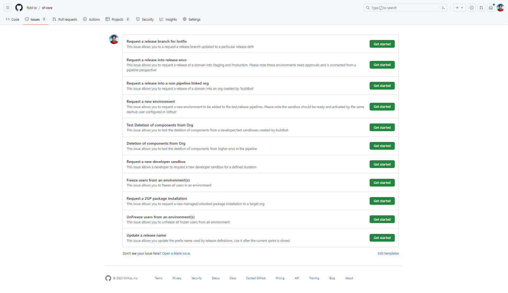

---
layout:
  title:
    visible: true
  description:
    visible: false
  tableOfContents:
    visible: false
  outline:
    visible: false
  pagination:
    visible: true
---

# sfops


sfops is currently available only to sponsors who use Github as their CI/CD platform. If you want more information on sfops, contact the #maintainers on DX@Scale channel


sfops is a collection of reusable  Github Actions, Reusable Workflows along with a Github pages based dashboad which aims to convert your Github Repo for Salesforce into a control centre for DX@Scale.

sfops utilize the concept of IssueOps, where the administration of ops activities are carried out by a user by creating an issue.

<figure><figcaption>
A snapshot of the issues available in sfops
</figcaption></figure>

<figure><figcaption>
Initiating a release in sfops
</figcaption></figure>
