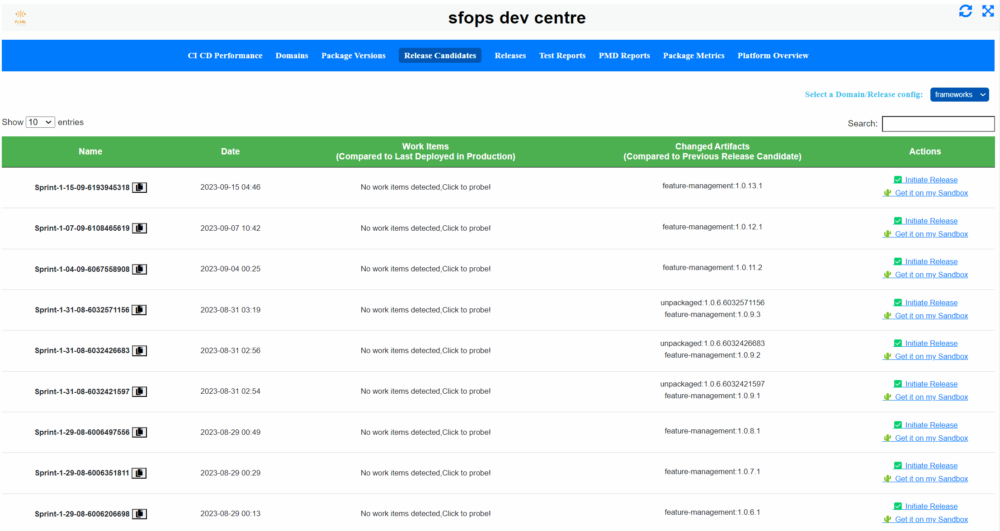

# Release a Domain

<figure><figcaption>
Release a domain workflow
</figcaption></figure>

The above diagram describes the "Release a Domain" workflow.  This workflow is triggered by creating an issue or by  clicking the "Initiate Release" from the dashboard. &#x20;

<figure><figcaption>
Initiating a release from the sfops dashboard  
</figcaption></figure>

This workflow then proceeds to fetch all the  environments that are marked with "**type:release"** and proceeds to execute a dry run of the command in parallel across all release environments. The output of the dry run will be available as a comment in the Github issue created.   The team could  have a final check on the deployment plan that will be executed by sfops before proceeding for the actual execution.

<figure><figcaption></figcaption></figure>

The release environments typically  is configured with "Required Reviewers" ([https://docs.github.com/en/actions/deployment/targeting-different-environments/using-environments-for-deployment#required-reviewers](https://docs.github.com/en/actions/deployment/targeting-different-environments/using-environments-for-deployment#required-reviewers)) and would need the respective environment owners to approve a release.  Please note  required reviewers are not required for the pre-release/ dry run check&#x20;
